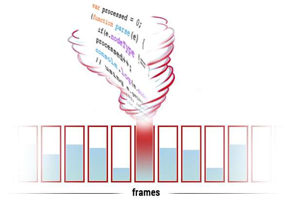

# Feeding the beast at 60fps

The browsers nowadays are really smart. They optimize everything and help us to produce better applications. They process our code as fast as possible and even on mobile devices deliver pleasant experience for the users. However, at the same time, it is pretty easy to write buggy code and make the browser freeze. We are not talking about slowing down the rendering. We are talking about no rendering at all. There are cases where we want so much from the browser that it just can't handle it.

## Process hundreds of DOM elements

I'm working on an [extension](https://github.com/krasimir/modulize) of Chrome that analyzes the CSS applied to the current page. I need to know every single CSS class used in the HTML tags. So, I have to go through the whole tree and get data from every element. I know, it sounds insane but I need to do it. There is no short way or tricky hack that I can apply. I just need to read every single tag and its attributes in order to realize my ideas. I started with the following code:

```js
var processed = 0;
(function parse(e) {
    if(e.nodeType !== 1 || e.nodeName == 'SCRIPT') return;
    processed++;
    console.log(e.nodeName.toLowerCase() + ' (' + processed + ')');
    // using e.getAttributes ...
    for(var i=0; i<e.childNodes.length; i++) {
        parse(e.childNodes[i]);
    }
})(document.querySelector('body'));
```

We have a simple recursion. The root element is the `<body>` tag. We call the `parse` function again and again till there is no more child nodes available. We are also skipping the `script` tags because we are not interested in their content. Let's get the following markup and run the script:

```html
<div class="content">
    <h1>Title</h1>
    <ul>
        <li>A</li>
        <li>B</li>
        <li>C</li>
    </ul>
</div>
<div class="footer">
    <p>Lorem ipsum dolor ...</p>
</div>
```

The result in the console is:

```js
body (1)
div (2)
h1 (3)
ul (4)
li (5)
li (6)
li (7)
div (8)
p (9)
```

Hey, it looks like it is working. I used this code for awhile and based all my logic on it. Everything was ok till I decided to test with real web site. I opened Facebook and run my extension. Yes, my browser was not responding for roughly ten seconds. It was obvious that there are more then nine DOM nodes on the page and my code was *kinda* wrong. 

I didn't think about optimization algorithms or tricky hacks. I started thinking about the processes happening in the browser and the real reason behind that freeze. I knew that the browser is trying to render data to the screen in 60 frames per second. So, we have ~16.6 milliseconds per frame. That's the time that the browser has to finish its job and render something on the screen. So, what I was doing is forcing the browser to calculate everything into a single frame. That's crazy and the result is absolutely logical.




## use objects as hash maps instead of arrays

## animate width of an element, boost it with transform on both columns