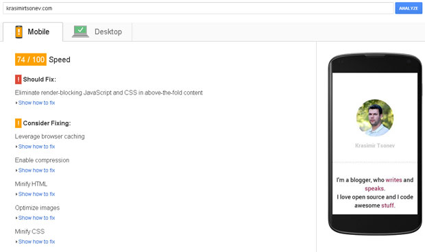
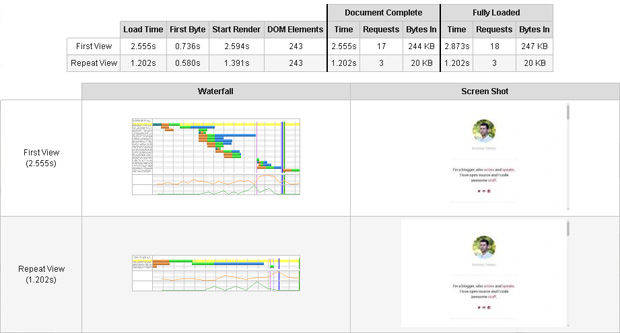
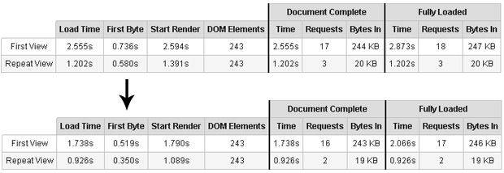
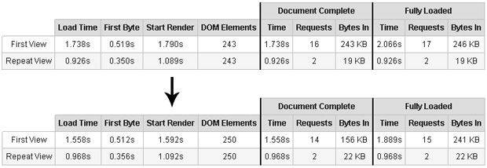
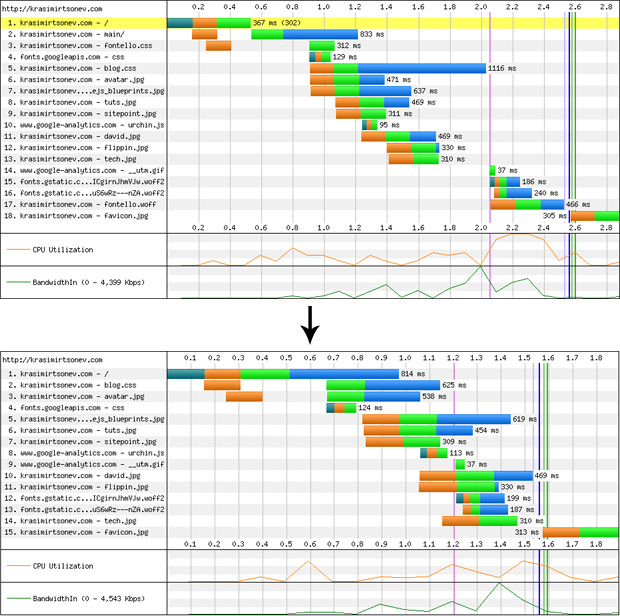
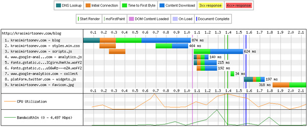

# Performance case study

I'm reading and watching a lot of interesting things regarding client-side performance. I'm interested in the browser's processes happening before and just after the page's load. There are tons of stuff to think about. Before a couple of days, I joined the [online workshop of Vitaly Friedman](https://shop.smashingmagazine.com/online-workshop-friedman-front-end-perf-rwd-august-15.html). I had a great time and learned some clever facts about performance optimization.

I spent weeks optimizing applications for clients, but I did not do that for my website. It is not optimized at all. Last few years I changed the blog a lot, and the whole codebase is awful. These days I found some free time and decided to use the learned techniques. I didn't have time for a complete rewrite but there were some changes that are easily applicable.

## The old state

There are two helpful online services that I used to analyze the main problems - [PageSpeedInsights](https://developers.google.com/speed/pagespeed/insights/) and [WebPageTest](http://www.webpagetest.org/). Here are two screenshots showing the old state of the [main page](http://krasimirtsonev.com/main/):

PageSpeedInsights

WebPageTest

I don't think that the results are satisfying. If you open [http://krasimirtsonev.com/main/](http://krasimirtsonev.com/main/) you will see that there are only text and few images. It should be a lot faster.

## Avoiding redirects

The *First Byte* characteristics provided by WebPageTest shows how quickly the server responds to a request. If we have a high value, this is usually because of redirects. I had one. The content of my `/index.php` was:

    <?php        
        header("Location: main/");
    ?>

When I transfer the content of `/main/index.php` to `/index.php` I won roughly 200ms.

I used absolute URLs for all the assets. So I didn't change even a line of the code in the new `/index.php` file.

## Eliminate render-blocking JavaScript and CSS in above-the-fold content

Google's PageSpeedInsights is saying that I have blocking JavaScript and/or CSS in the above-the-fold area. Of course, that was true. I had the following code in my head tag:

    <link rel="stylesheet" type="text/css" href="/blog/assets/css/fontello.css" />
    <link href='http://fonts.googleapis.com/css?family=Roboto:400,700&subset=latin,cyrillic-ext' rel='stylesheet' type='text/css'>
    <link rel="stylesheet" type="text/css" href='/blog/assets/css/blog.css' />

The first problem is [Fontello](http://fontello.com/). It's an icon font. I checked carefully, and it looks like that I'm using three icons from this CSS file in the above-the-fold content: Twitter's bird, GitHub's icon and the Facebook's one. I had a few more in the footer of the page, but this was not critical. Instead of relying on to an external file for these icons, I decided to use SVG images directly inlined in the HTML. The SVG is [well supported](http://caniuse.com/#feat=svg) and it is a good choice for non-detailed images.

The result was 200ms less for the initial rendering of the page. The document completion and the full loading is also faster:

Here are the differences in the waterfall views:

There are two more CSS files to think about. The first one holds the definition of the fonts that the site uses and the second one contains the rest of the styling. As I said the main page of my site was changed several times during the last years and I ended up by using the styles from my blog. So, to save time I directly referenced `blog.css`. It's 13KB file, and most of the styles there are blog-specific. What I did is to grab the font definitions and started a new file. In the end, I rewrite everything and produced much smaller file and of course have only one HTTP request.

In fact, the final minified styles were ~2K, so I decided to inline them directly into the HTML. The overall performance of the page increases and I didn't block the rendering anymore. Google's PageSpeedInsights showed me the score of `91/100` for mobile and desktop. It was `74/100` before to start the optimization. 

Here is the waterfall view so far:

## Leverage browser caching

It is good to optimize the first byte time, the number of requests or the file size, but there is nothing faster than the browser's cache. If our resources are loaded from there, then our application performs well. Sometimes the caching depends on the server's setup. Along with the CSS files or the images we may send different headers instructing the browser that the particular resource should be cached.

Sadly, I'm using a shared hosting, so I wasn't able to apply most of the possible optimizations. What I did is to play with the settings in my `.htaccess` file. For example, the following directive sent a *Cache-Control* header to the browser.

    <ifModule mod_headers.c>
      <filesMatch "\.(ico|jpe?g|png|gif|swf)$">
        Header set Cache-Control "max-age=2592000, public"
      </filesMatch>
    </ifModule>

I digged a bit and found [this](http://www.samaxes.com/2009/01/more-on-compressing-and-caching-your-site-with-htaccess/) blog post. I directly copied the code from there, and the result was surprising:

The repeated view is shown almost immediately. Apparently all the resources are fetched from the cache.

With the latest updates, I also reached *96/100* result in PageSpeedInsights.

## Image optimization

One of the things that kill the sites' performance is the images. It is good to compress them as much as possible. I used [RIOT](http://luci.criosweb.ro/riot/) for the purpose. It's a free tiny image optimizer. After passing the images to the program and uploading them to the server I got one more point from PageSpeedInsights - *97/100*. 

## The blog

The situation with [krasimirtsonev.com/blog](http://krasimirtsonev.com/blog) is the same. Google gave me *72/100* and PageSpeedTest showed that the page is fully loaded for 3,5 seconds. That's a lot.

In general, I applied the same techniques. 

* I deleted the old CSS file and wrote a new one from scratch.
* I replaced Fontello icons with SVG inlined images.
* There was a search functionality that no one used. So, I removed all the HTML, CSS and JavaScript related to that.
* jQuery was used as a dependency because of two DOM elements' selection. I removed it and used `document.querySelector` instead.
* The syntax highlighter that I used so far was [Prettify](https://google-code-prettify.googlecode.com/svn/trunk/README.html). I migrated to [Prism](http://prismjs.com/). The flickering effect is missing now because the Prism's JavaScript applies only colors to the code block. Most of the styling is done with pure CSS.
* The social networks' share buttons were transformed to direct share URLs. There are no iframes or inlined script tags for that.
* There is a Twitter *follow* button. It is now displayed after the page's load.

The final result looks like that:

The *Start render* time is a little bit longer than before (~100ms more) but the overall performance of the blog looks much better. Here is the waterfall view:

In general, the time for the first byte is a lot. That's because the crappy custom CMS that I'm using. I hope to find some time to improve it.

There are two other things that I'm considering:

* Inline the CSS styles as I did for the `/main` site. The stylesheet of the blog is 7.5KB. It's not that much but placing them into the HTML means that the user will download these 7.5KB every time. If we leave the CSS in an external file, the browser will cache it and will get it from the user's device.
* There are some tricks to transfer the fonts into the local storage. It is a nice optimization technique initially used by [TheGuardian](http://www.theguardian.com/uk) (I think). I may try doing it.

## Summary

The optimization of my website/blog was in my task list for a long time. What I did was changing only the CSS and adding few extra lines to the `.htaccess`. Luckily, this improved the overall performance significantly.