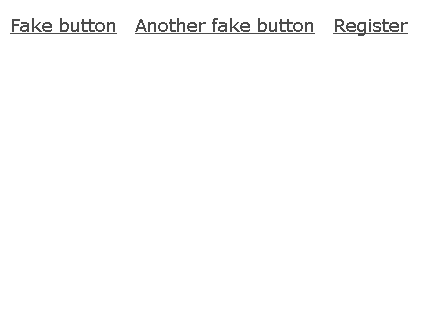

# Unit test your client-side JavaScript

I don't think that we have to discuss the importance of having tests. That's not something that we add to the project in addition. That's something that the project is based on. And because testing is so important we have bunch of tools in our disposal. We all know (I hope) how to test our back-end code. However, once we move to the front-end is a bit different. At the moment [we](http://trialreach.com/) are working on a big single page application and testing is one of our main focuses. In this article you will see how to unit test our client-side JavaScript. 

## The example

In order to illustrate the problem and its solution we will create a simple [AngularJS](https://angularjs.org/) application. AngularJS because it is a popular framework and probably you are familiar with it. Originally the concepts described in this article were applied to a project that uses [Ractive.js](http://www.ractivejs.org/) but it works for AngularJS and it will probably work for [Ember.js](http://emberjs.com/) or [Backbone.js](http://backbonejs.org/).

Let's say that we have a menu and the last link there shows a form for registering a new user. The fields in the form have some validation mechanisms. The are mandatory and have requirements for a minimum number of letters. Overall the example looks like that:



We have a placeholder below the form that shows an error message.

Here is the code that we start with:

```
<!doctype html>
<html ng-app="app">
  <head>
    <link rel="stylesheet" href="./css/styles.css">
    <script src="./vendor/angular.min.js"></script>
    <script type="text/javascript">

      angular.module('app', [])
      .controller('Controller', function($scope) {})
      .directive('registerForm', function() {
        ...
      })
      .directive('appHeader', function() {
        ...
      });

    </script>
  </head>
  <body>
    <div ng-controller="Controller">
      <app-header></app-header>
    </div>
  </body>
</html>
```

In AngularJS we have something called *directive*. Shortly, we may use this to encapsulate logic. That logic may be represented by a custom tag that we add to the page. *appHeader* directive displays the menu that we saw on the animated GIF above. Here is the implementation:

```
.directive('appHeader', function() {
  var link = function(scope, element, attrs) {
    scope.showRegisterForm = function() {
      element.find('register-form').css({
        display: 'block'
      })
    }
  }
  return {
    restrict: 'E',
    template: '\
      <header>\
        <ul>\
          <li><a href="#">Fake button</a></li>\
          <li><a href="#">Another fake button</a></li>\
          <li><a href="#" ng-click="showRegisterForm()">Register</a></li>\
        </ul>\
        <register-form class="register-form" />\
      </header>\
    ',
    link: link
  }
});
```

We define the markup directly into the JavaScript code which is not the best approach for dealing with templates. However, to simplify the example we will use this technique. Here we see the `<register-form>` tag that represents the form with the input fields.

The `registerForm` directive contains the fields' validation. Again, the template is placed directly inside the directive's definition:

```
.directive('registerForm', function() {
  return {
    restrict: 'E',
    template: '\
      <form>\
        <p>Please fill the form below</p>\
        <label for="username">Your name</label>\
        <input type="text" name="username" id="username" ng-model="username" />\
        <label for="username">Password</label>\
        <input type="password" name="password" id="password" ng-model="password"/>\
        <br />\
        <input type="button" value="register" ng-click="register()" id="register-button" />\
        <br />\
        <span id="message">{{message}}</span>\
      </form>\
    ',
    controller: function($scope) {      
      var validateInput = function() {
        var u = $scope.username;
        var p = $scope.password;
        if (u === '' || u === undefined) {
          return { status: false, message: 'Missing username.'}
        } else if (p === '' || p === undefined) {
          return { status: false, message: 'Missing password.'}
        } else if (u.length < 10) {
          return { status: false, message: 'Too short username.'}
        } else if (p.length < 6) {
          return { status: false, message: 'Too short password.'}
        }
        return { status: true }
      }
      $scope.register = function() {
        var isValid = validateInput();
        if(false === isValid.status) {
          $scope.message = isValid.message;
          return;
        } else {
          $scope.message = '';
        }
      }
    }
  }
})
```

A little bit more code but it is again fairly simple. The key point in that directive is the `validateInput` method. It processes the input typed by the user and decides if it is a valid or not. It also chooses and displays the proper error message.

## Show me the unit ...

Now it gets interesting. How we are going to unit test our application? The first thing and maybe the most important one is to divide the application into small isolated modules so we form units. In the example above the two directives may be considered as units. The header does not contain custom logic and basically there is nothing to test there. Yes, we have a *click* handler, but we do not have to write tests for that. That is part of the framework and we expect that the guys from Google tested it already. A lot more interesting is the registration form. We want to make sure that whatever the user types into the fields our directive will react properly. 

We need to extract `registerForm` from the other code. If we look closer we will see that the directives in AngularJS are nothing but functions. So we may change our code to:

```
// a new file register-form.js
registerFormDirective = function() {
  return {
    restrict: 'E',
    ...
    ...
  }
};

// main file
<script src="./js/register-form.js"></script>
<script>
angular.module('app', [])
.controller('Controller', function($scope) {})
.directive('registerForm', registerFormDirective)
...
</script>
```

We moved the definition to the global scope and later use it in the main file. (it's really a good practice to use the global scope but let's keep it simple)

Now we have a simple JavaScript function that may be called from anywhere most importantly could be tested. 

## Writing the test

There are few popular approaches for testing client-side JavaScript. 

* Of course, the trivial one is to write the test and run it into the browser. This makes sense if you work in a small team and you all agree to run the tests before deploying. However, that's not a good option if your company is a big one. You can not trust yourself or your colleagues for dealing with one additional step before shipping the code. This process should be automated. Or in other words it should be integrated into the deployment setup.
* There are headless browsers like [PhantomJS](http://phantomjs.org) or [Selenium](https://code.google.com/p/selenium/) that programmatically visit our pages and interact with them. If we take this way we will avoid the manual running of the tests. The problem is that we are not running unit tests, we are doing integration testing. Our `registerForm` directive may be unit tested only if we create a separate page for it. This definitely does not scale. So, this option is good for integration but not unit testing.
* The last option, and the one that we are going to use, solves both of the problems above - automation and unit testing. We are not going to visit pages. We will simply pull the unit, create an instance of it and start operating with the UI. No headless browser involved. We will use Node.js. Our `registerForm` is now a simple JavaScript function. So it should be possible to execute it in node.

Not all of them, but most of the popular client-side frameworks nowadays use the DOM. That's a problem because in Node.js we do not have a DOM tree. Thankfully there is a module that brings a very good simulation of it. It's called [jsdom](https://www.npmjs.org/package/jsdom). Let's create a *package.json* and put the module there:

```
{
  "name": "test",
  "version": "0.0.0",
  "dependencies": {
    "mocha": "2.0.1",
    "jsdom": "1.1.0"
  }
}
```

Along with jsdom we added [Mocha](http://mochajs.org) - a popular JavaScript test framework available for Node.js and the browser. We hit `npm install` and we are ready to write our test. The basic skeleton of our spec file is:

```js
var assert = require('assert');

suite('Register form', function() {
  test('validations', function(done) {
      this.timeout(5000);
      ...
      done();
    });
  });
});
```

`assert` is a Node.js native module specifically made for unit testing. `suite` and `test` are here because we are going to use the `tdd` interface of Mocha. If our test succeed we should call the `done` method. We increase the maximum timeout to five seconds so we give a chance to AngularJS doing its job.

The main challenge writing the test is to create a proper environment for AngularJS. So it functions like it is in the browser. Here is how to do this using `jsdom`:

```js
var jsdom = require("jsdom");
jsdom.env({
  html: '<html ng-app="app"><body><div ng-controller="Controller"><register-form></register-form></div></body></html>',
  scripts: [
    __dirname + '/../vendor/angular.min.js',
    __dirname + '/../js/register-form.js'
  ],
  features: {
    FetchExternalResources: ["script"],
    ProcessExternalResources: ["script"],
  },
  done: function(errors, window) {
    ...
  }
});
```

We `require` the module and call the `env` method that effectively creates a virtual page. The markup of that page is defined in the `html` property. The code there is valid for bootstrapping AngularJS application and *showing* our register form. Of course we need including AngularJS and `register-form.js` files which is done in the `scripts` property. At the end we are telling to `jsdom` that we want our script tags to be fetched and processed. The `done` property accepts callback which is the entry point of our test.

As we can see from the example above we have an access to a `window` object. That is the same global `window` object that we have in the browser. In fact `jsdom` is a JavaScript implementation of the WHATWG DOM and HTML standards. So there are tons of stuff that we can do from here. We can select elements from the generated DOM by using `window.document.querySelector` or trigger events. That's all we need to test the functionality in our directive. 

We may start by defining a few helper functions that will make our life easier:

```js
var $ = function(selector) {
  return window.document.querySelector(selector);
}
var trigger = function(el, ev) {
  var e = window.document.createEvent('UIEvents');
  e.initEvent(ev, true, true);
  el.dispatchEvent(e);
}
```

Then add the basic AngularJS code that will show our directive on the *screen*:

```js
window
  .angular
  .module('app', [])
  .controller('Controller', Controller)
  .directive('registerForm', window.registerFormDirective);
```

And of course the body of the controller that performs the actual testing:

```js

var Controller = function($scope) {
  var runTests = function() {

    var register = $('#register-button');
    var message = $('#message');
    var username = $('#username');
    var password = $('#password');

    register.click();
    assert.equal(message.innerHTML, 'Missing username.');

    username.value = 'test';
    trigger(username, 'change');
    register.click();
    assert.equal(message.innerHTML, 'Missing password.');

    password.value = 'test';
    trigger(password, 'change');
    register.click();
    assert.equal(message.innerHTML, 'Too short username.');

    username.value = 'testtesttesttest';
    trigger(username, 'change');
    register.click();
    assert.equal(message.innerHTML, 'Too short password.');

    password.value = 'testtesttesttest';
    trigger(password, 'change');
    register.click();
    assert.equal(message.innerHTML, '');

    done();

  };
  setTimeout(runTests, 1000);
}

```

Because there is some processing we need that little hack with the `setTimeout` call. We just make sure that the DOM and AngularJS bindings are fully initialized before selecting elements.

Another interesting rule that we have to follow is triggering `change` event every time when we type something into the text boxes. That's because otherwise AngularJS does not have an idea that we changed the value. This is still valid if we have logic attached to *blur*, *focus* or *click* events.

### A quick note

Not to be pedantic but we have to mention that the test written above is more like functional test and not unit test. The truth is that the unit test operates only on one particular method of a class and it is indeed testing only one specific functionality. By testing the register form directive we are doing more then that. 

## Final words

Writing of tests is not always easy. However, it should be there and it should be automatic. Sometimes using tools like Selenium does not make possible testing the atoms of our system. Sometimes it is difficult to setup such tools or integrate them. `jsdom` is one of the nice workarounds and it definitely works for [us](http://trialreach.com/).

#### Just the whole test

```js
var assert = require('assert');

suite('Register form', function() {

  test('validations', function(done) {
    this.timeout(5000);

    var jsdom = require("jsdom");
    jsdom.env({
      html: '<html ng-app="app"><body><div ng-controller="Controller"><register-form></register-form></div></body></html>',
      scripts: [
        __dirname + '/../vendor/angular.min.js',
        __dirname + '/../js/register-form.js'
      ],
      features: {
        FetchExternalResources: ["script"],
        ProcessExternalResources: ["script"],
      },
      done: function(errors, window) {
        if(errors != null) console.log('Errors', errors);

        var $ = function(selector) {
          return window.document.querySelector(selector);
        }

        var trigger = function(el, ev) {
          var e = window.document.createEvent('UIEvents');
          e.initEvent(ev, true, true);
          el.dispatchEvent(e);
        }

        var Controller = function($scope) {
          var runTests = function() {

            var register = $('#register-button');
            var message = $('#message');
            var username = $('#username');
            var password = $('#password');

            register.click();
            assert.equal(message.innerHTML, 'Missing username.');

            username.value = 'test';
            trigger(username, 'change');
            register.click();
            assert.equal(message.innerHTML, 'Missing password.');

            password.value = 'test';
            trigger(password, 'change');
            register.click();
            assert.equal(message.innerHTML, 'Too short username.');

            username.value = 'testtesttesttest';
            trigger(username, 'change');
            register.click();
            assert.equal(message.innerHTML, 'Too short password.');

            password.value = 'testtesttesttest';
            trigger(password, 'change');
            register.click();
            assert.equal(message.innerHTML, '');

            done();

          };
          setTimeout(runTests, 1000);
        }

        window
          .angular
          .module('app', [])
          .controller('Controller', Controller)
          .directive('registerForm', window.registerFormDirective);

      }
    });

  });

});
```