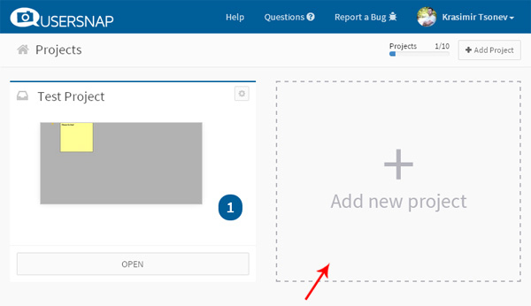
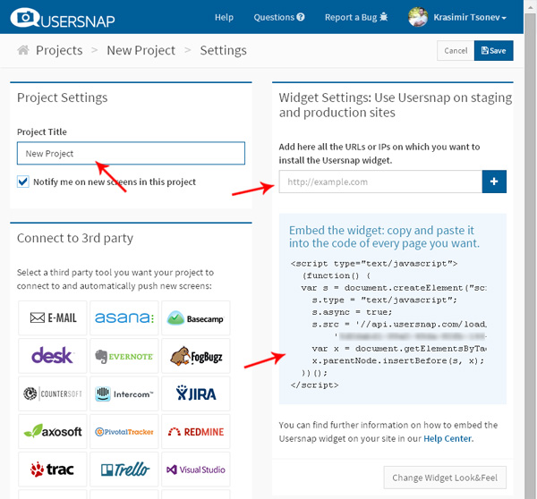
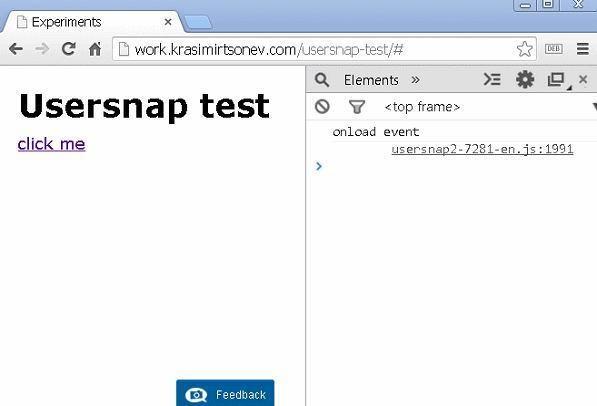
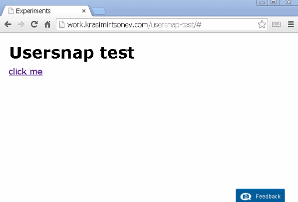
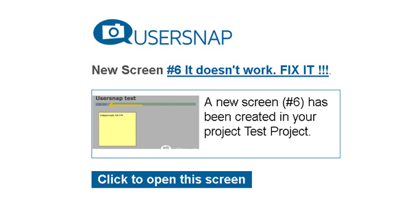
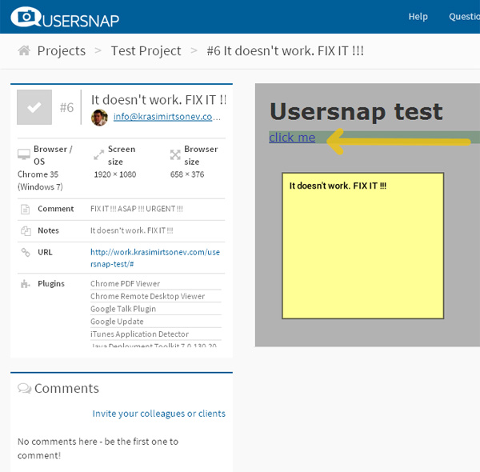
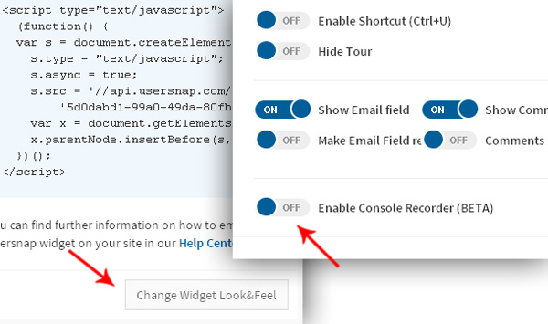
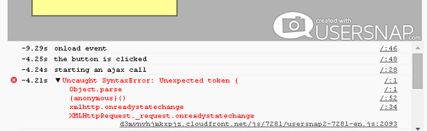

# Usersnap - the holy grail of bug reporting

The bug reporting is something very important for us. As developers, we produce code that should work everywhere. Not only on our machines. No matter how many times we test our application it often happens that it does not work properly for the client. We all know how helpful is an email with text "It does not work. Fix it ASAP!". [Usersnap](http://usersnap.com/) is amazing tool that removes the gap between you (the developer) and the non-techy guy from the other side. 

## How it works

You need to create an account at [http://usersnap.com/](https://usersnap.com/#signup). Once you are finished and logged in you have to create a new project. Normally you will be redirected to your projects' list. If this does not happen just click on the *My Projects* link in the header.

The picture below shows that I already added a project called *Test Project*.

Here is how the dashboard looks like when we click on the *Add new project* button.

We should set the name of the project and add URL (or several URLs). These are the pages where we want to get feedback for. There is only one step left. We should get the Usersnap's `
            
        </body>
    </html>

There are title, link and empty `
` element. We add the code provided by Usersnap in the end. Once the page is loaded that code adds a little button in the lower right area of the page. That is how the user will start its feedback sending.

Let's say that we have a simple JSON file with data. We want to show part of this data once the user clicks on the link. 

    // data.json
    {
        "items": [
            { "id": 10 },
            { "id": 11 },
            { "id": 12 },
            { "id": 13 }
        ]
    }

We need to access DOM elements. So, here is a small utility function. A shortcut to `document.querySelector`:

    var qs = function(selector) {
        return document.querySelector(selector);
    }

The entry of our application is the handler of `window.onload` event. That is the place where we will attach an event listener to the link and trigger the Ajax request:

     window.onload = function() {
        console.log('onload event');
        qs('#click-me').addEventListener('click', function() {
            console.log('the button is clicked');
            qs('section').setAttribute('style', 'background: #9CCDA6;');
            ajax('data.json', function(err, data) {
                if(err) { alert(err); return; }
                else { data = JSON.parse(data); }
                console.log('the data is here ', data);
                qs('#data').innerHTML = 'There are ' + data.items.length + ' items.';
            });
        });
    }

When the user clicks on the link, we are changing the background of the section element. This is how we indicate that we are going to load the JSON data. The `ajax` method accepts the path to the file and callback. If everything is ok, the user should see the number of the items (4) on the screen. The `ajax` method looks like that:

    var ajax = function(file, cb) {
        console.log('starting an ajax call');
        var xmlhttp = window.XMLHttpRequest ? new XMLHttpRequest() : new ActiveXObject('Microsoft.XMLHTTP');
        xmlhttp.onreadystatechange = function() {
            if (xmlhttp.readyState == 4) {
                if(xmlhttp.status == 200){
                    cb(null, xmlhttp.responseText);
                } else if(xmlhttp.status == 400) {
                    cb('There was an error 400')
                } else {
                    cb('something else other than 200 was returned')
                }
            }
        }
        xmlhttp.open('GET', file, true);
        xmlhttp.send();
    }

It looks like our little experiment is ready for a test. We open our lovely Chrome browser and run the application:

Everything looks ok. We are happy with the result and send a link to the client. 

## Feedback required

Guess what! The client does not receive the same experience. He opens our *tested* page, clicks on the button, and only the color of the section is changed. There is no information about the number of the items. He makes a phone call and says "The site is broken. Fix it!". It cannot be broken. We tested it, and it worked on our machine. We start asking question after question till we find the type and version of the client's browser. Eventually, we teach him how to use MS Paint and request a screenshot. The annoying long process that we all know about.

Now let's see how easy is to use Usersnap. With just a few clicks, the client can report the problem:

We receive an email containing the message and a link to a feedback's page:

So, from the client's point of view the whole process is straightforward. There is no need prepare email, generate images or deal with the question about the version of the browser. Everything is collected by Usersnap. Check out the below image. That is what we have as result:

We see the resolution, the browser, the note. Moreover, we are able to invite more people and start a discussion related to the problem. Awesome! Isn't it?

## Bug reporting

Let's get back to our example. The feedback so far is nice but doesn't help us a lot. We have only visual look of the client's browser. We have no idea what is going on behind the scene. 

Before a couple of days the guys from Usersnap introduced a new feature - [super powers for web developers](http://usersnap.com/blog/super-powers-for-web-developers/). Now, we are able to receive a lot more from the user's computer. As developers, we are interested in the JavaScript processes happening on the page. If we check the example's code again, we will see a lot of `console.log` statements. There is a way to receive them along with a screenshot. Let's tweak our Usersnap's widget and enable the *Console recorder*. 

The project page contains a button called *Change Widget Look&Feel*. It is below the `<script>` code that we copied. If we click it, we will have a chance to modify the widget shown to the client. That is the place where we could enable the *Console Recorder*. 

There is no difference for the user, but now the feedback includes the console's output.

Now we see that there is an error `Uncaught SyntaxError: Unexpected token {`. We see also the call stack, and it looks like `JSON.parse` method failed. So, the problem is probably in the JSON returned by our server. It is somehow invalid. Now imagine that this JSON is generated specifically for the client's account. The only one way to replicate the problem on our machine is to log in with the right credentials and repeat the actions that the client did. It often happens  that we cannot do that. The debugging of such problems could take hours and even days. Usersnap points us in the right direction. We are able to solve the problem quickly without losing the client's time.

## Summary

[Usersnap](http://usersnap.com/) could be a time safer in your project. We do not have to talk about making screenshots or write dozen emails to find out what is going on on the client's machine. It is priceless service for designers and developers.

P.S.
This is not a promotional blog post. Usersnap is simple and helpful and deserves attention. Easy to use, even by nontechnical people. It worked great for me in my latest project and saved tons of main and client's time.