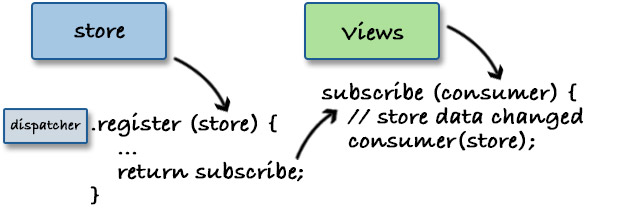

# Implement Flux architecture in 60 lines of code

I'm obsessed by making my code simpler. I didn't say *smaller* because having less code doesn't mean that is simple and easy to work with. I believe that big part of the problems in the software industry come from the unnecessary complexity. Complexity which is a result of our own abstractions. You know, we (the programmers) like to abstract. We like placing things in black boxes and hope that these boxes work together.

[Flux](http://facebook.github.io/flux/) is an architectural design pattern for building user interfaces. It was introduced by Facebook at their [F8](https://youtu.be/nYkdrAPrdcw?t=568) conference. Since then, lots of companies adopted the idea and it seems like a good pattern for building front-end apps. Flux is very often used with [React](http://facebook.github.io/react/). Another library released by Facebook. I myself use React+Flux in my [daily job](http://trialreach.com/) and I could say that the simplicity is one of the main benefits there. Flux as a pattern is simple enough to get your head around and React's API is really small.

## Flux architecture and its main characteristics


The main actor in this pattern is the **dispatcher**. It acts as a hub for all the events in the system. It's job is to receive notifications that we call **actions** and bypass them to all the **stores**. The store decides if it is interested or not and reacts by changing its internal state. The change is passed to the **views** which are (in my case) React components. If we have to compare Flux to the well known MVC we may say that the store is similar to the model.

The actions are coming to the dispatcher either from the views or from other part of the system like services. For example a module that performs a HTTP request. When it receives the result it may fire an action saying that the request was successful and attach the received data.

A wrong data flow is one of the biggest pitfalls in flux. For example, we may have an access to the store in our views but we should never call store methods that mutate its internal state. This should only happen via actions. Or we may end up with a store that receives and action and dispatches another one.

*(More or less the explanation above is based on my reading of the Flux's documentation and my day-to-day experience with the pattern. Have in mind that you may see other interpretations. And you better do :))*

## My two cents

As every other popular concept Flux also has some [variations](https://medium.com/social-tables-tech/we-compared-13-top-flux-implementations-you-won-t-believe-who-came-out-on-top-1063db32fe73). I decided to try and write my own. One of the main goals was to be as simple as possible. That's how [Fluxiny](https://github.com/krasimir/fluxiny) was born. 

<small>*You may be surprised but I invested a good amount of time in naming the repository. Do you know how difficult is to come with a short library name which at the same time is not registered in NPM? . For the record Fluxiny = Flux + tiny.*</small>

In the next few sections we'll see how I created [Fluxiny](https://github.com/krasimir/fluxiny). Why is that small and how I ended up having the code as it is.

### The dispatcher

In most of the cases we need a single dispatcher. Because it acts as a glue for the rest of the system's parts it makes sense that we have only one. There are two inputs to the dispatcher - actions and stores. The actions are simply forwarded to the stores so we don't necessary have to keep them. The stores however should be tracked inside the dispatcher:


That's what I started with:

```
var Dispatcher = function () {
  return {
    _stores: [],
    register: function (store) {  
      this._stores.push({ store: store });
    },
    dispatch: function (action) {
      if (this._stores.length > 0) {
        this._stores.forEach(function (entry) {
          entry.store.update(action);
        });
      }
    }
  }
};
```

The first thing that we notice is that we *expect* to see an `update` method in the passed stores. It will be nice to throw an error if such method is missing. Here is a smaller helper that we may use in other cases like this one:

```
var _has = function (obj, prop, error) {
  if (!(prop in obj)) throw new Error(error);
  return true;
};
```

And the `register` method becomes:

```
register: function (store) {
  if (_has(store, 'update', 'Every store should implement an `update` method')) {
    this._stores.push({ store: store });
  }
}
```

### Bounding the views and the stores

The next logical step is to connect our views to the stores so we render when the state in the stores is changed.



Some of the flux implementations available provide a helper function that does the job. For example:

```
var detach = Framework.attachStore(view, store);
```

However, I don't quite like this approach for several reasons:

* To make `attachStore` works we expect to see a specific API in the view. We kind of define a new public method in all the views. Or in other words we say "Your view should have such API so we are able to connect the store to it.". If we go down this road then we'll probably define our own view class which could be extended so we don't bother the developer with our flux stuff. Then we say "All your views should extend our class". This doesn't sound good either because we may decide to switch to another flux provider and we have to amend all the views.
* React provide [mixins](https://facebook.github.io/react/docs/reusable-components.html#mixins). That's a "nice" way to define behavior of existing React component. So, in theory we may create a mixin that does the bounding for us. Well, I think that this is a bad idea. And not only me but [Facebook too](https://medium.com/@dan_abramov/mixins-are-dead-long-live-higher-order-components-94a0d2f9e750#.qvntyleij). My reason of not liking mixins is that they modify my components in a non-predictable way. I have no idea what is going on behind the scenes. So definitely I'm crossing this option.


