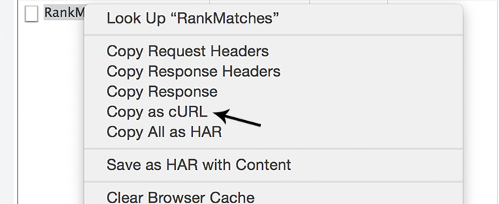
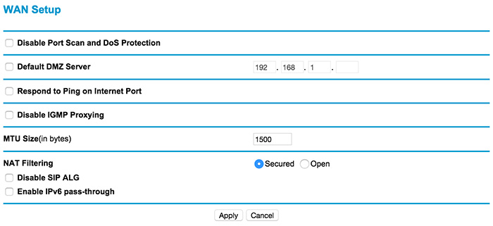

I recently finished watching [Mr. Robot](http://www.imdb.com/title/tt4158110/). If you didn't check out the show please do. Last few days I felt like I'm hacking something. Just like Elliot in *MR. Robot*. This blog post is about fixing a weird bug. Really strange problem with a failing HTTP request.

The projects that I'm working on live in a virtual box. [We](http://trialreach.com/) have a wonderful setup where all the tools/parts of the applications are installed in a virtual machine. We don't have to think about database or servers. Thankfully to [Vagrant](https://www.vagrantup.com/) and [Ansible](http://www.ansible.com/) everything is on place with a single command.

Here is a raw diagram of how the problematic application works:

```
     Host machine
      (browser)
          |
          | request
          |
|--- virtual machine ---|
|         |             |
|       nginx           |
|    (proxy_pass)       |
|         |             |
|-----------------------|
          |
          |
    Local network
    (home router)
          |
          |
        My ISP
          |
          |
       External
         API
```

The browser in the host machine sends a request to a virtual host that is pointing to the IP of the virtual machine. Inside that VM we have a nginx server listening. The server then proxy pass the request to an external API. 

Nothing too complicated but here is what happens on my machine: the fourth request to specific API endpoint fails and it is marked as *canceled* by the browser.


First I thought that it is something with the app. However, I quickly eliminated this option because Safari and Firefox don't have this problem. So I had to investigate in Chrome. I continued by opening [chrome://net-internals/#events](chrome://net-internals/#events). It's a nice tool showing the events that occur in the browser including the network activity. I tracked down the problematic request and saw the following:

```
t=25868 [st=   2]     -HTTP_TRANSACTION_SEND_REQUEST
t=25868 [st=   2]     +HTTP_TRANSACTION_READ_HEADERS  [dt=8000]
t=25868 [st=   2]       +HTTP_STREAM_PARSER_READ_HEADERS  [dt=8000]
t=33867 [st=8001]          CANCELLED
t=33868 [st=8002]   -URL_REQUEST_START_JOB
                     --> net_error = -3 (ERR_ABORTED)
t=33868 [st=8002]    URL_REQUEST_DELEGATE  [dt=0]
t=33868 [st=8002] -REQUEST_ALIVE
```

It looked like I didn't pay enough attention on the *canceled* report in the Network panel. Even there we may see that the request fails after eight seconds. Eight doesn't sound like a standard timeout so I searched about this number in the application's code. I found the following:

```
var requestOptions = {
  url: url,
  method: method,
  data: data,
  json: true,
  prepareParams: options.prepareParams,
  defaultHeaders: {},
  headers: {
    'Content-Type': type,
    'X-Requested-With': 'XMLHttpRequest',
    'Accept': '*/*'
  },
  timeout: 8000
};
```

The server doesn't respond in these eight seconds and the front-end simply cancels the request.

The next step was to check the logs of the nginx server. There are two of those which I'm aware of. An error and access log. In the first one:

```
[01/Dec/2015:16:51:27 +0000] "POST /api/<...> HTTP/1.1" 499 0 7.998
```

A quick look of `/etc/nginx/conf.d/logging.conf` showed me that 499 is the status of the request, 0 bytes were send, and 7.998 is the time of the request. And I knew that 499 means:

```
HTTP 499 in Nginx means that the client closed the connection
before the server answered the request.
```

My thought was "Ok, let's wait a bit to see what will happen". I bumped these eight seconds to two minutes and then I got the nginx's 504 gateway timeout response. 

```
HTTP/1.1 504 Gateway Time-out
Server: nginx/1.4.6 (Ubuntu)
Date: Wed, 02 Dec 2015 05:22:48 GMT
Content-Type: text/html; charset=utf-8
Content-Length: 593
Connection: keep-alive
```

So, it's not in the front-end. The app is the reason while the request is canceled but it's not responsible for not having the response at all. Chrome offers a nice **Copy as cURL** feature for all the HTTP requests.



I got the request and paste it in my terminal. And indeed I waited one minute and received the same 504 gateway time-out response from nginx. The issue was somewhere inside my VM. Maybe between the nginx and that external API server. I decided to monitor the access log with:

```
tail -f /var/log/nginx/<access>.log
```

The curl request is running in one tab and the monitoring in another one. And I again saw the same failing request:

```
"POST /api/<...> HTTP/1.1" 504 778 60.115 60.115
```

My assumption was that the request goes to nginx and the remote server simply doesn't respond. I was wondering what is going on and started removing different pieces from the request. Part of the payload, some of the headers. At some point it worked. The interesting thing is that there wasn't anything specific. It was enough to make the request smaller which makes me think that the problem has something to do with the size of the request.

My last hope was to check the router of my home network because after that I had to contact my ISP. These are the two things between the nginx server and the remote API. I was thinking about [sniffing](http://netsecurity.about.com/cs/hackertools/a/aa121403.htm) my router traffic or something like that but before going this way I decided to use the 3G connection of my phone. I turned off the router and get Internet from my phone's hot spot. And guess what, the request passes. So the problem is my router. I started playing with the settings there and here it is - "MTU Size(in bytes)". The description of this option says:

```
MTU Size
The normal MTU (Maximum Transmit Unit) value for most 
Ethernet networks is 1500 Bytes, 1492 Bytes for PPPoE 
connections, or 1436 for PPTP connections. For some 
ISPs you may need to reduce the MTU. But this is 
rarely required, and should not be done unless you 
are sure it is necessary for your ISP connection.
```

So I set it to 1500 and the problem was gone. Everything, from the curl request to the requests in Chrome and the other browsers succeeded.



I'm still not sure why I had this issue and why Safari and Firefox managed to process the request. The external API is a Microsoft service so maybe there is something with how they control the set packets. 