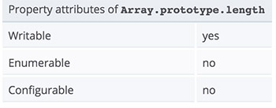

# Unexpected usage of Array's length property

I like reading code of other developers. It's a nice way to learn patterns, techniques and small tricks. Recently I found something about `Array.prototype.length` which caught my attention.

We all know that while working with Arrays `.length` returns the number of the added items. For example:

```
var arr = ['a', 'b', 'c', 'd'];
arr.length; // 4
```

However, it turns out that `length` is not just a read-only property. We may set values to it. ([MDN](https://developer.mozilla.org/en-US/docs/Web/JavaScript/Reference/Global_Objects/Array/length)) 



What happen if we have four elements in the array and we set length to five:

```
var arr = ['a', 'b', 'c', 'd'];
arr.length = 5;
arr; // ["a", "b", "c", "d", undefined]
```

We added one item at the end of the array. It's value is `undefined. We may set `length` to ten and we'll get six more `undefined` elements. Incrementing works as well:

```
var arr = ['a', 'b', 'c', 'd'];
arr.length += 3;
arr; // ["a", "b", "c", "d", undefined × 3]
```

The more interesting use case is decreasing the length or setting it to a number less then the actual elements' count. 

```
var arr = ['a', 'b', 'c', 'd'];
arr.length -= 1;
arr; // ["a", "b", "c"]
```

We deleted the last element of the array. We may of course say `arr.length -= 3` and we'll end up with only one item `["a"]`. Yes, we have a `pop` method which also removes the latest record from the array but decreasing the length allow us erasing multiple elements.

Can we use the same technique to pull elements from the beginning of the array? The answer is yes. It's ugly but it is possible:

```
var arr = ['a', 'b', 'c', 'd'];
arr.reverse().length -= 2;
arr.reverse();
arr; // ["c", "d"]
```

Every string may be converted to an array right. Having the array we may apply the learned above to truncate the text at a given word. For example:

```
var str = 'Brown fox jump over the lazy dog';

function truncate (text, word) {
  var words = text.split(' ');
  var pos = words.indexOf(word);

  if (pos === -1) return text;
  words.length = pos;
  return words.join(' ') + ' ...';
}

truncate(str, 'over'); // Brown fox jump ...
truncate(str, 'nope'); // Brown fox jump over the lazy dog
```


