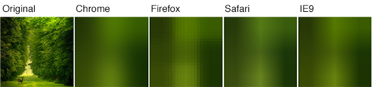
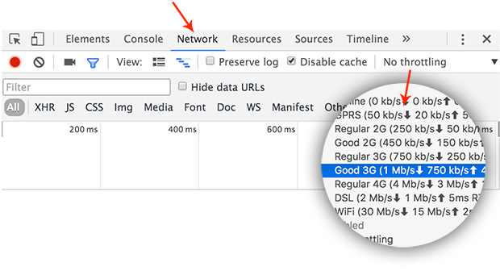

# Lazy-load your images with Coloor

Last week I landed on an article by [Manuel Wieser](https://twitter.com/manuelwieser) called [Dominant Colors for Lazy-Loading Images](https://manu.ninja/dominant-colors-for-lazy-loading-images) and I found the topic really interesting. It's about lazy-loading of images. Something that [Medium](https://jmperezperez.com/medium-image-progressive-loading-placeholder/) is using.

I didn't know but most browsers handle image resizing pretty well. They blur the image and it doesn't look so bad. Check out the image below. That's how the browsers render the 3x3 version of the original image. 



Firefox didn't blur the image as the other browsers but this could be solved by apply a [CSS blurring](http://codepen.io/jmperez/pen/PPOXzY/).

So, it is fine serving a tiny image and then lazy load the big one with JavaScript. The most trivial implementation of such loading could be:

```
var img = new Image();
img.onload = function () {
  // ... swap the tiny image with the big one
}
img.src = 'path/to/photo.jpg';
```

What Manuel was suggesting in his [article](https://manu.ninja/dominant-colors-for-lazy-loading-images) is using node (or PHP) to generate the small equivalents. The interesting part for me was not using an actual file but producing a base64 encoded string. For example:

```
var gm = require('gm');

gm('test.jpg')
  .resize(3, 3)
  .toBuffer('GIF', function (error, buffer) {
      console.log('data:image/gif;base64,' + buffer.toString('base64'));
  });
```

Where [`gm`](https://www.npmjs.com/package/gm) is a GraphicsMagick and ImageMagick for node. The image above encoded in a base64 string looks like that:

```
data:image/gif;base64,iVBORw0KGgoAAAANSUhEUgAAAAMAAAADCAYAAABWKLW/AAAAAklEQVR4AewaftIAAAAuSURBVGNUt+D+r+vIxfDk8Q8GJi4uJoYvrxgYHt/8zcDEycXEIK/AxcDw/x8DAO3IC6w6YFW8AAAAAElFTkSuQmCC
```

It's tempting working with a string instead of a file because we are saving HTTP requests. It's a good optimization if we have to display icons or vector graphics. SVGs are very often inlined too. 

## Meeting Coloor

So, knowing the stuff above and hunting about image processing in node I decided to create [Coloor](https://github.com/krasimir/coloor). It's a HTML preprocessor that decorates the `` tags with base64 version of the image. It uses [jimp](https://www.npmjs.com/package/jimp) to transform the image and get its dimensions. Jimp is an image processing library written entirely in JavaScript which means that we don't have to setup ImageMagic or GraphicMagic separately.

To use the module we should run `npm i coloor -D`. Then in our build process we pass our markup and directory (or directories) where our images stay.

```
var Coloor = require('coloor');

Coloor(
  '<html string>',
  ['', ''],
  function (decoratedHTML) {
    // ...
  }
);
```

The decorated HTML for `` is:

```

```

The `src` attribute gets the base64 string so the browser shows the preview immediately. The actual path to the file is stored in `data-coloor` so we can preload it with JavaScript. Which happens with the following snippet:

```
function Coloor(){var d=document;var ce="createElement";var ga="getAttribute";function isCanvasSupported(){var elem=d[ce]("canvas");return!!(elem.getContext&&elem.getContext("2d"))}function preload(image){var src,pi,li,w,h,size;if(!isCanvasSupported()){image.src=src;return}src=image[ga]("data-coloor");size=image[ga]("data-coloor-size").split("x");w=parseInt(size[0]);h=parseInt(size[1]);pi=new Image;li=new Image;pi.onload=function(){var canvas=d[ce]("canvas");var ctx=canvas.getContext("2d");canvas.width=w;canvas.height=h;ctx.drawImage(pi,0,0,w,h);image.src=canvas.toDataURL("image/png")};pi.src=image[ga]("src");li.onload=function(){image.src=src};li.src=src}var images=d.querySelectorAll("img[data-coloor]");for(var i=0;i<images.length;i++){preload(images[i])}}Coloor();
```
*(The uncompessed version of this code could be seen [here](https://github.com/krasimir/coloor/blob/master/src/preload/index.js))*

Adding it in the page will automatically preload all the decorated images and will replace the tiny ones with the original images.

When I started working on [Coloor](https://github.com/krasimir/coloor) I realized that there is an issue when rending the image's preview. Changing the `src` attribute means that the browser renders an image with completely different dimensions. This may result in layout shifts when the original image finishes loading. The problem could be solved by styling the `` tag with absolute sizes but we know that very often we rely on responsive layouts. This made me think for a slightly different approach:

* We decorate the image with base64 encoded string but also original image size
* At runtime we load the small preview in a canvas and resize it to the original dimensions
* At the end we export the resized version to base64 and apply it to the `src` attribute

Following this workflow we are sure that the `` tags contain previews that match the original images by size. So we don't have layout shifts.

Checkout the demo here [krasimir.github.io/coloor/example](http://krasimir.github.io/coloor/example/). The preloading will work only the first time because the browser caches the images.

Use the network throttling in Chrome to simulate slow internet connection.




