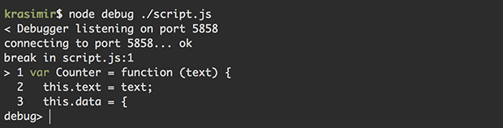
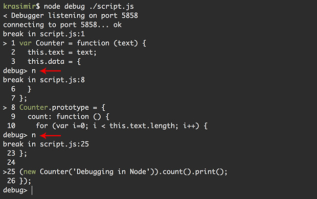
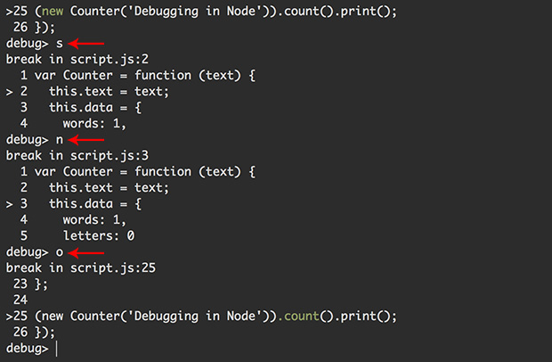
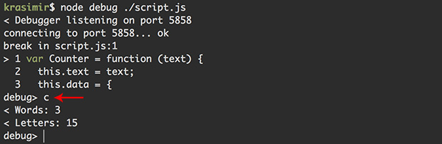
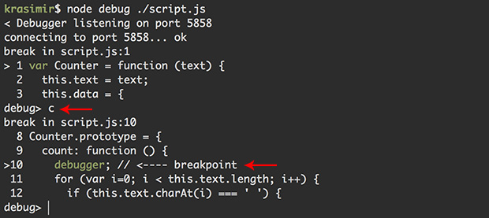
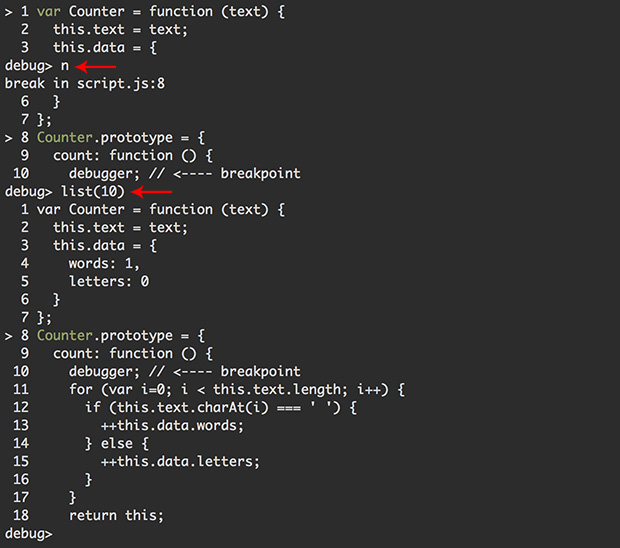
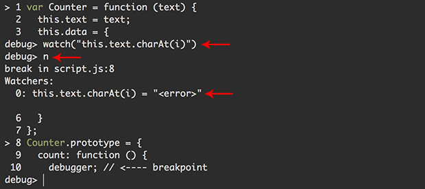
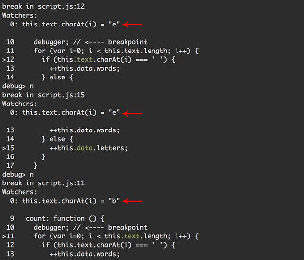

# Debugging with Node

Node has a wonderful [debugger](https://nodejs.org/api/debugger.html). As a front-end developer I'm mainly using Chrome's tools but sometimes I run things only in Node and this native feature comes handy. In this article we'll see how to debug in the terminal using Node's debugger.

## When to use Node's debugger

The native debugger is useful when we run Node programs trough the terminal and we want to see how they behave. We can run something in the console and expect what's doing line by line. There are plenty of stuff available - breakpoints, variable or expression watching, step-by-step execution.

*There is another popular module for that [node-inspector](https://github.com/node-inspector/node-inspector) but in some cases it gets tricky running it. I ended up using the native one and I'm pretty satisfied with the result.*

## How to run the debugger

All we have to do is adding `debug` to our command. Let's get the following simple script:

```js
// script.js

var Counter = function (text) {
  this.text = text;
  this.data = {
    words: 1,
    letters: 0
  }
};
Counter.prototype = {
  count: function () {
    for (var i=0; i < this.text.length; i++) {
      if (this.text.charAt(i) === ' ') {
        ++this.data.words;
      } else {
        ++this.data.letters;
      }
    }
    return this;
  },
  print: function () {
    console.log('Words: ' + this.data.words);
    console.log('Letters: ' + this.data.letters);
  }
};

(new Counter('Debugging in Node')).count().print();
```

It's a small program that counts the words in a sentence and all the characters but not spaces. If we run the program now we'll get the following result:


Let's assume that there is a problem with the script and we want to run it in debug mode. We have to use `node debug ./script.js`:



Now our program is paused in the very first one and the debugger expects our input. Notice that the debugger is listens on specific port. This means that we can control it remotely and that's what (I believe) node-inspector is using. We may use another tool that connects on port 5858 and send commands to the debugger.

## Available commands

While we are in debug mode we have several commands available. Let's use the example above and see the most popular ones.

### Next step (`next` or `n`)

`next` or `n` is used for moving one step forward. In our case the second step in the program is the prototype definition. After that we reach the point where we create an instance of the `Counter` *class*.



Notice the red arrows. They are showing where I typed `n` and pressed `Enter`.

### Step in (`step` or `s`)

Just moving one step forward is not always enough. That's because *next step* means next step but in the context of the current function. Sometimes we want to dive into another method. In such cases we use *step in* command.


We use `n` till we reach the line that creates an instance of our `Counter` class. Sending `s` forces the debugger to jump inside the `Counter` function.

### Step out (`out` or `o`)

Once we finish inspecting a function we may want to go out and continue the program's execution. Following the example above and sending `o` moves the debugger to the `count()` call.



### Continue execution (`cont` or `c`)

When we debug complex applications we have lots of stuff happening. Very often we have long execution path and in order to reach the interesting part we have to pass several functions. `next` command is not working well in such cases simply because we have to run it multiple times. It's better to use `count` or `c`. It tells to the debugger "Continue till you find a breakpoint". We didn't set any breakpoints so far so typing `c` as a first command executes the whole program and we see the result.



### Setting a breakpoint

To be honest I'm not using commands to set breakpoints. This is possible by using `setBreakpoint()` or `sb()` which sets a breakpoint at the current line. Same functions accept a line number so we can break at specific line. What I'm doing is adding `debugger;` statement in my code. This acts as a breaking point (it works in a browser too). 

Let's say that we want to inspect the loop that reads the words in my sentence. In the very beginning of the `count` function we add `debugger;`:

```js
count: function () {
  debugger; // <---- breakpoint
  for (var i=0; i < this.text.length; i++) {
    if (this.text.charAt(i) === ' ') {
      ++this.data.words;
    } else {
      ++this.data.letters;
    }
  }
  return this;
},
```

If we run the debugger it will pause at the first line of the script. Then pressing `c` will instruct the debugger to continue till it finds a breakpoint or the program finishes.



### Increase visibility 

You probably noticed that we see just five lines of our program at a time. Sometimes we want to see more. `list` command is exactly about that. It accepts a digit and that's the number of the visible code lines. For example:



### Watching

The last command that we'll check in details is `watch`. It accepts an expression and it is printing it out at every debugging step. To illustrate how it works we'll use the following expression:

```
watch("this.text.charAt(i)")
```

Of course `this.text` doesn't makes sense everywhere. It is available in the `count` function and that's where it returns a proper value. In the first steps we just get `<error>` string.



However, if we move forward and reach the `for` loop we'll see the exact character read.



### Other commands

There are some other commands which I personally don't use. A full list of the available ones could be found [here](https://nodejs.org/api/debugger.html).

## Debugging front-end code


