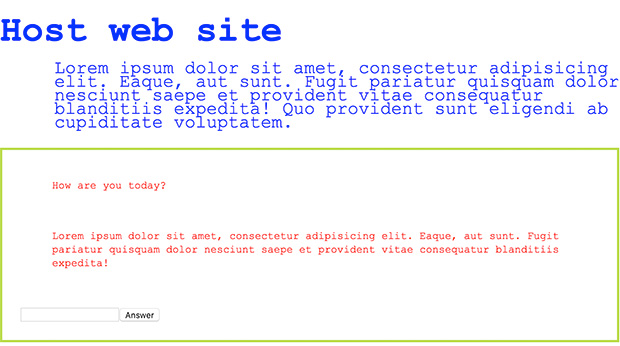
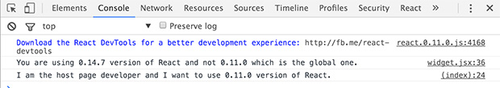

# iFrame, or not, that is the question

One of the things that I really like at [work](http://trialreach.com/) is the fact that we reserve time for research tickets. We have unknowns and we make a research to find out more information on the topic. We then base our decisions on the results. Recently we had to decide whether to use an `<iframe>` for a third party widget development. I feel that the collected information may be handy to someone else so I decided to write it down here.

## The story

A *widget* in the context of web development is a piece of UI that delivers additional functionality or information. It's very often a product of a third company. As such it needs to be integrated into the pages in a save way and (A) it works as expected and (B) doesn't break what's on the page already. There are primarily two ways of achieving this:

* Using an `<iframe>` tag
* Providing a `<script>` tag that injects markup

So, the question is which one of the two methods fits better. They both have pros and cons so let's explore.

## iFrame, unicorns and rainbows

The `<iframe>` tag may seems like a ancient technology but there are some valid positive sides:

**Security**

The `<iframe>` tag is considered the safer approach. Mainly because the JavaScript inside the iFrame is running in the context of another page. Of course there are always [security risks](http://stackoverflow.com/questions/7289139/why-are-iframes-considered-dangerous-and-a-security-risk) but it is definitely better then including an external JavaScript that has a direct access to our DOM tree.

**Doesn't block the rendering**

The iFrame is not blocking the rendering. We may still get our page while the external content is loading.

**It's not blocked by the main page's JavaScript failure**

Imagine that we develop our awesome widget and we place it somewhere with the non-iframe solution. It's a JavaScript driven. Now imagine that something else on the page fails before the browser reaches our JavaScript file. We'll fail delivering our content. By using an iFrame we base the injecting only on HTML rendering, not JavaScript execution.

**Easy to update / versionning**

At some point we will need to update the widget. If we distribute our widget as a JavaScript snippet we are not directly controlling the injection. It's a piece of code that we can't contribute to and changing it means reaching every single developer that uses it.

**Our own styling**

It's our own page so the only ones styles that apply are coming from our own stylesheet. This could be a disadvantage if the widget needs to be customizable but that's another story.

**Testing**

To test if our widget works we'll probably have to create a dummy page and simply put the iFrame there. Because our page lives in a sandbox we don't really care what's on that dummy page. The most common bugs that we may encounter are layout related.

## iFrame, the bad parts

**In parallel**

Indeed the iFrame's content is loaded in parallel with main page's content. However, what third party data is [blocking](http://www.stevesouders.com/blog/2009/06/03/using-iframes-sparingly/) is the `onload` event. All the iFrames on the page also use [the same](http://www.stevesouders.com/blog/2009/06/03/using-iframes-sparingly/) connection pool. We have a limited number of connections. The browsers open just a few in parallel to a given web server.

**Responsiveness**

iFrames are not exactly responsive. By definition we **have to** provide width and height. Otherwise the browser is rendering nothing. Even though there are some [workarounds](https://www.smashingmagazine.com/2014/02/making-embedded-content-work-in-responsive-design/) the size of the iFrame is always an issue. Especially on mobile devices where we can change the orientation.

**Configuration**

Very often we provide settings for our widgets. The communication between the main page and the iFrame is not always an easy task. There is a [`postMessage`](https://developer.mozilla.org/en-US/docs/Web/API/Window/postMessage) API or we may pass GET parameters to the iFrame's page but it's not that straightforward as with the JavaScript-only approach.

## JavaScript-only, unicorns and rainbows

In this approach we provide a `<script>` with (or without) some JavaScript that injects DOM elements. Our code is run in the context of the main page and it's basically part of it.

**Flexibility**

We don't have difficulties passing settings to our widget because we have an access to our JavaScript logic. In most cases such widgets expose API that is directly affecting the produced HTML.

**Custom Styling**

Whatever page styles we have they apply for the widget's HTML. It depends of the goal but very often this is considered a positive thing. JavaScript-only widgets are just easy to style.

**No layout issues**

Because our markup is part of the current page we don't have so big layout issues. No cut of content, proper media queries and responsive images, fluid layout is just working.

## JavaScripti-only, the bad parts

Unfortunately, in our case this solution comes with more technical issues then advantages. Here are some of the main ones:

**CSS and JavaScript conflicts**

This is the biggest issue have such a widget. Especially with the CSS. If we want a specific representation we have to (first) reset the styles for our bit and (second) beat the [specificity](https://developer.mozilla.org/en-US/docs/Web/CSS/Specificity) of the current page's rules. This will probably lead to lots of inline styling which may need additional efforts.

The JavaScript from another point of view may be isolated. We all know about [self-executed closures](http://stackoverflow.com/questions/592396/what-is-the-purpose-of-a-self-executing-function-in-javascript). And if we use a bundler like browserify we guarantee that the used dependencies are right ones. However, the current page may use libraries that modify the prototype of native objects like Array or String. This will definitely put some of our logic in risk. Polyfills or in general the global scope is insecure too. We can't rely fully on APIs defined in this area.

**Difficult to update**

If we use a single `<script>` tag then it's easy to update the widget. However, if we distribute with a bootstrap script to hundred of clients we are in big trouble. What if we want to update the little snippet. We have to contact all these people and give them the new version. What if there is a bug in there.

**Should be served via HTTPS**

Our external JavaScript file should be served via HTTPS. Otherwise the users may start getting warnings that the page is loading insecure content from third parties.

**Error handling**

If there is an error in our widget we have to handle it in a proper way. We can't leak the error outside of our logic because this may break some functionality in the main page.

**Shared workspace**

Because our script is executed in the context of the main page it kind of depend on it. What if there a JavaScript error before the browser reaches our code. We'll fail delivering our content.

**Testing**

The testing of JavaScript-only widgets may need replicating the host page. This could be challenging because we have to copy the exact scripting and styling.

## An experiment

Even though the above sections tells me that the `<iframe>` is more appropriate (in our case) I decided to create an example of JavaScript-only widget. It's available in GitHub [here](https://github.com/krasimir/third-party-react-widget) and it's a small React based app that looks like that:



Where the green box is the widget. We have the following markup:

```
<div class="container">
  <header><h1>Host web site</h1></header>
  <section>
    <p>Lorem ipsum dolor sit amet, consectetur adipisicing elit. Eaque, aut sunt. Fugit pariatur quisquam dolor nesciunt saepe et provident vitae consequatur blanditiis expedita! Quo provident sunt eligendi ab cupiditate voluptatem.</p>
    <div class="third-party">
      
      <!-- Our lovely widget -->
      <div id="trialreach-widget"></div>
      <script src="./widget.js"></script>

    </div>
  </section>
</div>
```

Our widget is represented by two tags - a `<div>` and a `<script>` tag. There is no bootstrap logic. `widget.js` finds its `#widget` container and renders the following React component:

```
class Widget extends React.Component {
  render() {
    return (
      <CSSX styles={ this.css() }>
        <form>
          <p>How are you today?</p>
          <p>Lorem ipsum dolor sit amet, consectetur adipisicing elit. Eaque, aut sunt. Fugit pariatur quisquam dolor nesciunt saepe et provident vitae consequatur blanditiis expedita!</p>
          <input type="text" />
          <button>Answer</button>
        </form>
      </CSSX>
    );
  }
  css() {
    return (
      <style>
        form {
          background: #FFF;
          border: 3px solid #BADA55;
          padding: 1em;
        }
        p {
          color: #F00;
          padding: 0;
          margin-bottom: 3.5em;
          font-size: 14px;
        }
      </style>
    );
  }
}
```

*(I'm using [CSSX](https://github.com/krasimir/cssx) to dynamically apply scoped CSS to the elements in my component. That's of course not important right now. There are plenty of other options to do that.)*

**CSS conflicts**

I didn't paste that but there is some style on the main page. It's an external `styles.css` file that contains:

```
body {
  margin: 0;
  padding: 0;
  font-family: 'Courier New';
  color: #00F;
  font-size: 24px;
  line-height: 18px;
}
p {
  color: #00F;
  margin-left: 3em;
}
```

Now, if we check the image in the beginning of this section we'll see that the applied font in our widget is `Courier New`. We may not want that and in order to fix it we have to overwrite the body's `font-family`. The second clash is the margin of the paragraph. We do have `margin-left: 3em;` coming from the page. In our React component we set a value to `margin-bottom` only so we get the left spacing applied and our nice widget layout looks weird.

**JavaScript conflicts**

I used browserify to create a bundle that contains React and the component above. I used `0.14.7` in the widget and at the same time I included `0.11.0` on the page. Nothing bad happens. There are two versions of React on the same page and to prove that I printed two messages in the console - one from within the widget and one from the page.



## Conclusion

As a conclusion I would say that if the widget is a simple one we may use the JavaScript-only solution. Like for example a call-to-action button or just a small ad. However, if we are delivering a complex logic with series of screens then we better go with the `<iframe>`. 


