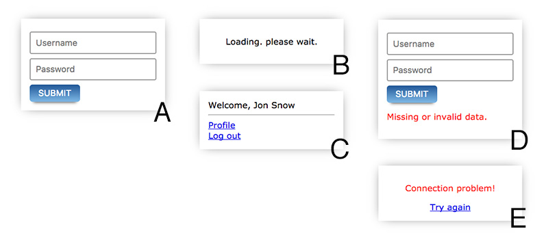
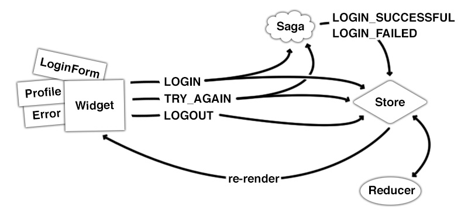

# Replacing Redux with a state machine

This article is about [Stent](https://github.com/krasimir/stent) - a [Redux](http://redux.js.org/)-liked library that creates and manages state machines for you. The title is not really correct because Stent implements some of the Redux's core ideas and in fact looks a lot like Redux. At the end of the material we will see that both libraries have a lot in common. Stent is just using state machines under the hood and eliminates some of the boilerplate that comes with Redux.

If you wonder what is a state machine and why it makes UI development easier check out ["You are managing state? Think twice."](http://krasimirtsonev.com/blog/article/managing-state-in-javascript-with-state-machines-stent) article.

*The source code of the examples in this post is available [here](https://github.com/krasimir/blog-posts/tree/master/2017/Stent/code).*


## The idea

In medicine, a stent is a metal or plastic tube inserted into the lumen of an anatomic vessel or duct to keep the passageway open[*](https://en.wikipedia.org/wiki/Stent). Or in other words it is a tool that restores blood flow through narrow or blocked arteries. I've made the parallel with an application that I worked on. The application state there had many dependencies so I was basically stuck into a logical loop and that little library helped me solve the problem. It kinda freed my mind and made me define clear states and simple transitions. At the same time Stent is following some of the core ideas of Redux and I felt comfortable working with it. The concepts which I _stolen_ from there:

* There are still **actions** that drive the application. Firing an action means transitioning the machine from one state to another.
* The transitions are defined similarly to Redux's **reducers**. They accept current state and action and return the new state.
* The async processes are handled using the **saga** pattern. Same as in [redux-saga](https://redux-saga.js.org/) project.
* The wiring of React components happen via similar helper - a [connect](https://github.com/krasimir/stent#connect-and-disconnect) function.

My main goal was to create a library that controls state machines but has an API similar to Redux.

## Teaching by example

To show the difference I decided to use an example close to the one from ["You are managing state? Think twice."](http://krasimirtsonev.com/blog/article/managing-state-in-javascript-with-state-machines-stent) article and create it first with Redux then with Stent. It is about a login form and its various states.



* State **A** is the default one. That is the first thing that we should render.
* Screen **B** appears when the user clicks the "Submit" button
* If everything is ok and the credentials are correct we display **C**. Where the user may click "Log out" which will lead to flushing all the user info and displaying again **A**.
* Screen **D** is rendered when the user submits an empty form (or when using wrong credentials)
* And **E** is an edge case where we send some data but there is no connection to the server. In this case we just give an option to re-send the form.

To make this example working let's first write a simulation of our server. For the purpose of this post is enough to write a simple mock that returns a promise.

## The authorization service

```js
// services/errors.js
export const CONNECTION_ERROR = 'CONNECTION_ERROR';
export const VALIDATION_ERROR = 'VALIDATION_ERROR';

// services/Auth.js
import { CONNECTION_ERROR, VALIDATION_ERROR } from './errors';

const TIMEOUT = 1000;
const USER = { name: 'Jon Snow' };

const Auth = {
  login({ username, password }) {
    return new Promise(
      (resolve, reject) => setTimeout(function () {
        if (username === '' || password === '') {
          return reject(new Error(VALIDATION_ERROR));
        } else if (username === 'z' && password === 'z') {
          return reject(new Error(CONNECTION_ERROR));
        }
        resolve(USER);
      }, TIMEOUT)
    );
  }
}

export default Auth;
```

The `Auth` module has one method `login` that accepts `username` and `password`. The service returns a promise and there are three possible results:

* If the user submits the form with no username and password we reject the promise with `VALIDATION_ERROR`
* If the user types `z` for both username and password we reject the promise with `CONNECTION_ERROR`
* In every other case where the use fills the fields with _some_ data we resolve the promise with dummy data (the `USER` constant)

The resolving/rejecting is wrapped in a `setTimeout` call so we get the feeling of real HTTP request.

## The dummy React components

How the application looks like really doesn't matter. Here is a list of components that are the same for both implementations. They are [*presentational components*](http://krasimirtsonev.com/blog/article/react-js-presentational-container-components) which simply render stuff and fire callbacks. You may easily skip this section and jump directly to the [Redux implementation](#redux-implementation). It's here just for a reference.

**A component for rendering links.**

I didn't want to write `event.preventDefault()` everywhere.

```js
// components/Link.jsx
export default class Link extends React.Component {
  _handleClick(event) {
    event.preventDefault();
    this.props.onClick();
  }
  render() {
    return (
      &lt;a href="#" onClick={ event => this._handleClick(event) }>
        { this.props.children }
      &lt;/a>
    );
  }
}
```

**`Error` component renders the screen with the "Try again" option.**

The one covering the connection problem.

```js
// components/Error.jsx
const Error = ({ message, tryAgain }) => (
  &lt;div className='tac'>
    &lt;p className='error'>{ message }&lt;/p>
    &lt;Link onClick={ tryAgain }>Try again&lt;/Link>
  &lt;/div>
);
export default Error;
```

**The `LoginForm` component is responsible for the first look of our widget.**

```js
// components/LoginForm.jsx
export default class LoginForm extends React.Component {
  _submit(event) {
    event.preventDefault();
    this.props.submit({
      username: this.refs.username.value,
      password: this.refs.password.value
    })
  }
  render() {
    return (
      &lt;form>
        &lt;input type='text' ref='username' placeholder='Username' />
        &lt;input type='password' ref='password' placeholder='Password' />
        &lt;button onClick={ event => this._submit(event) }>Submit&lt;/button>
      &lt;/form>
    );
  }
}
```

**A component that shows the welcome message and links after successful log in.**

```js
// components/Profile.jsx
export default function Profile({ name, viewProfile, logout }) {
  return (
    &lt;div>
      Welcome, { name }
      &lt;hr />
      &lt;Link onClick={ viewProfile }>Profile&lt;/Link>&lt;br />
      &lt;Link onClick={ logout }>Log out&lt;/Link>&lt;br />
    &lt;/div>
  );
}
```

And we have one more `components/Widget.jsx` but it is different for both examples so it will be discussed later. The project so far looks like this:

```
/components
  /Error.jsx
  /Link.jsx
  /LoginForm.jsx
  /Profile.jsx
  /Widget.jsx
```

## Redux implementation

When I start working on a Redux application I always think about actions first. What kind of processes will need to handle. 

### Actions

In our example we have a request to a back-end which is followed by either success or failure screens. If it fails we have a try-again process. We may also log out. So here are the constants that will represent these actions:

```js
// redux/constants.js
export const LOGIN = 'LOGIN';
export const LOGIN_SUCCESSFUL = 'LOGIN_SUCCESSFUL';
export const LOGOUT = 'LOGOUT';
export const LOGIN_FAILED = 'LOGIN_FAILED';
export const TRY_AGAIN = 'TRY_AGAIN';
```

And the action creators that use them:

```js
// redux/actions.js
export const login = data => ({ type: LOGIN, payload: data });
export const loginSuccessful = userData => ({ type: LOGIN_SUCCESSFUL, payload: userData });
export const logout = data => ({ type: LOGOUT });
export const loginFailed = error => ({ type: LOGIN_FAILED, payload: error });
export const tryAgain = () => ({ type: TRY_AGAIN });
```

### Reducer

The next step is to handle the actions above. Or in other words to write the reducer. The function that accepts current state and action and returns the new state.

```js
// redux/reducers.js
export const Reducer = (state = initialState, { type, payload }) => {
  switch(type) {
    ...
  }
}
```

And here it becomes interesting because we should start thinking about state management. What *state* means for us and how we will represent it in the store. I came up with the following:

```js
// redux/reducers.js
const initialState = {
  user: null,
  error: null,
  requestInFlight: false,
  credentials: null
}
```

The `user` is probably the most important part of our store. We will use it to keep the user's data returned from the back-end. The thing is that alone is not enough to cover our UI screens. When `null` we may say that the request didn't happen yet or it's in progress or maybe it happened but the logging process failed. Because of this uncertainty we have to introduce `error` and `requestInFlight`. They will be used like flags to define an error state and split the flow to before and after the HTTP request. `credentials` is a storage for what the user typed so we can submit the form again when covering the try-again feature.

Let's see how our reducer modifies the state when receiving actions. The `LOGIN` action:

```js
export const Reducer = (state = initialState, { type, payload }) => {
  switch(type) {
    case LOGIN:
      return {
        ...state,
        requestInFlight: true,
        credentials: payload
      };
    default:
      return initialState;
  }
}
```

We have to turn `requestInFlight` flag on and keep the credentials. Now the view layer may check if `requestInFlight` is `true` and if yes display the loading screen. If the request succeed we will receive `LOGIN_SUCCESSFUL`.

```js
case LOGIN_SUCCESSFUL:
  return {
    user: payload,
    error: null,
    requestInFlight: false,
    credentials: null
  };
```

`requestInFlight` should be turned off and the `user` property may be filled in with the action's payload. We don't need to keep the `credentials` anymore so we set it to `null`. We also have to flush out the `error` (if any) because we may have an UI which depends on it. When however the request fails we will receive action of type `LOGIN_FAILED`:

```js
case LOGIN_FAILED:
  return {
    ...state,
    error: payload,
    requestInFlight: false
  };
```

`LOGIN_FAILED` is dispatched always after `LOGIN` so we know that the `credentials` are currently in the store. We use the spread operator (`...state`) which guarantees that we keep that information. The action's payload contains the actual error so we assign it to the `error` property. The request process is finished so we turn `requestInFlight` off. This will let the view to show an appropriate UI based on the error.

The last two type of actions `LOGOUT` and `TRY_AGAIN` look like that:

```js
case LOGOUT:
  return initialState;
case TRY_AGAIN:
  return {
    ...state,
    requestInFlight: true
  }
```

If the user want to log out we just bring the initial state where the everything is equal to `null` and `requestInFlight` is false. The `TRY_AGAIN` is just turning `requestInFlight` to `true` and keeps everything else.

### Making the HTTP request

Last year or so I am experimenting with different options for handling async processes. Right now [redux-saga](https://redux-saga.js.org/) library makes the most sense to me. That is why I decided to use it here too _(a really good introduction to the saga pattern could be found [here](https://formidable.com/blog/category/redux-saga/))_. The example is small enough so we can go with a single saga.

```js
// redux/saga.js
import { takeLatest, call, put, select } from 'redux-saga/effects';
import { LOGIN, TRY_AGAIN } from './constants';
import { loginSuccessful, loginFailed } from './actions';
import { getCredentials } from './selectors';
import Auth from '../services/Auth';

export default function * saga() {
  yield takeLatest([ LOGIN, TRY_AGAIN ], function * () {
    try {
      const credentials = yield select(getCredentials);
      const userData = yield call(Auth.login, credentials);
      yield put(loginSuccessful(userData));
    } catch (error) {
      yield put(loginFailed(error));
    }
  });
}
```

The saga stops and waits for `LOGIN` or `TRY_AGAIN` actions. They both should lead to firing the HTTP request. If everything is ok we call the `loginSuccessful` action creator. The reducer processes the `LOGIN_SUCCESSFUL` action and we now we have the user data in the Redux's store. If there is an error we call `loginFailed` with the given error. Later the `Widget` component decides what to render based on that error.

### Wiring our main React component to Redux

`Widget.jsx` will be the component which is wired to Redux's store via the `connect` function. We will need both map state and dispatch to props.

```js
import { CONNECTION_ERROR } from '../services/errors';

class Widget extends React.Component {
  render() {
    ...
  }
}

const mapStateToProps = state => ({
  isInProgress: state.requestInFlight,
  isSuccessful: state.user !== null,
  isFailed: state.error !== null,
  name: state.user ? state.user.name : null,
  isConnectionError: state.error && state.error.message === CONNECTION_ERROR
});

const mapDispatchToProps = dispatch => ({
  login: credentials => dispatch(login(credentials)),
  tryAgain: () => dispatch(tryAgain()),
  logout: () => dispatch(logout())
});

export default connect(mapStateToProps, mapDispatchToProps)(Widget);
```

Let's first talk about `mapStateToProps`. The first three are booleans that basically tell us in which part of the process the user is. Making a request, successfully logged in or something failed. We use almost all the props from our state - `requestInFlight`, `user` and `error`. The `name` is directly derived from the user's profile data. And because we have different UI based on the type of error we need a fourth flag `isConnectionError`.

The actions that are triggered by the user are `LOGIN`, `TRY_AGAIN` and `LOGOUT`. In `mapDispatchToProps` we create anonymous functions to dispatch those actions.

### The rendering bit

The last part which I want to show you is how we render the [dummy components](#the-dummy-react-components). That's the `render` function of the `Widget` component:

```js
render() {
  const { isInProgress, isSuccessful, isFailed } = this.props;

  if (isInProgress) {
    return &lt;p className='tac'>Loading. please wait.&lt;/p>;
  } else if (isSuccessful) {
    return &lt;Profile name={ this.props.name } logout={ this.props.logout } />;
  } else if (isFailed) {
    return this.props.isConnectionError ?
      &lt;Error
        tryAgain={ this.props.tryAgain } 
        message='Connection problem!' /> :
      (&lt;div>
        &lt;LoginForm submit={ this.props.login } />
        &lt;p className='error'>Missing or invalid data.&lt;/p>
      &lt;/div>)
  }
  return &lt;LoginForm submit={ this.props.login } />;
}
```

When having the boolean flags as props we need four `if` statements to achieve the desired result.

* If `isInProgress` is set to `true` we render the loading screen.
* If the request is successful the `Profile` component is displayed.
* If the request fails we check the error's type and based on it decide to either render the `Error` component or the same login form but with an error message.
* If none of the above is truthy we return only the `LoginForm` component.

### Redux implementation - done

More or less this is how I will approach a feature implementation if I have to use Redux. It is a definition of actions and their action creators. Then reducers and eventually handling async processes. At the end is the actual rendering (via React in our case).

The application follows [one-direction data flow](http://krasimirtsonev.com/blog/article/react-js-in-design-patterns#one-way-direction-data-flow) where the user interacts with the UI which leads to dispatching of an action. The reducer picks that action and returns a new version of the state. As a result Redux triggers re-rendering of the React components tree.


