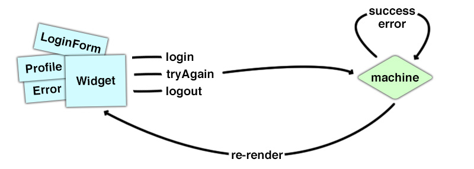

This article is about [Stent](https://github.com/krasimir/stent) - a [Redux](http://redux.js.org/)-liked library that creates and manages state machines. Stent implements some of the Redux's core ideas and in fact looks a lot like it. At the end of this post we will see that both libraries have a lot in common. Stent is just using state machines under the hood and eliminates some of the boilerplate that comes with Redux's workflow.

If you wonder what is a state machine and why it makes UI development easier check out ["You are managing state? Think twice."](http://krasimirtsonev.com/blog/article/managing-state-in-javascript-with-state-machines-stent) article. I strongly recommend reading it so you get a better context.

*The source code of the examples in this post is available [here](https://github.com/krasimir/blog-posts/tree/master/2017/Stent/code).*

* [The idea](#the-idea)
* [Teaching by example](#teaching-by-example)
* [The authorization service](#the-authorization-service)
* [The dummy React components](#the-dummy-react-components)
* [Redux implementation](#redux-implementation)
* [Implementing with Stent](#implementing-with-stent)
* [Final words](#final-words)


## The idea

In medicine, a stent is a metal or plastic tube inserted into the lumen of an anatomic vessel or duct to keep the passageway open[*](https://en.wikipedia.org/wiki/Stent). Or in other words it is a tool that restores blood flow through narrow or blocked arteries. I've made the parallel with an application that I worked on. The application's state there had many dependencies so I was basically stuck into a logical loop and that little library helped me solve the problem. It kinda freed my mind and made me define clear states and simple transitions. At the same time Stent is not a lot different then Redux because:

* There are still **actions** that drive the application. Firing an action means transitioning the machine from one state to another.
* The transitions are defined similarly to Redux's **reducers**. They accept current state and action and return the new state.
* The async processes are handled using the **saga** pattern. Same as in [redux-saga](https://redux-saga.js.org/) project.
* The wiring of React components happen via similar helper - a [connect](https://github.com/krasimir/stent#connect-and-disconnect) function.

My main goal was to create a library that controls state machines but has an API similar to Redux.

## Teaching by example

To show the difference I decided to use an example close to the one from ["You are managing state? Think twice."](http://krasimirtsonev.com/blog/article/managing-state-in-javascript-with-state-machines-stent) article and create it first with Redux then with Stent. It is about an user widget and its various states.


* State **A** is the default one. That is the first thing that we should render.
* Screen **B** appears when the user clicks the "Submit" button
* If everything is ok and the credentials are correct we display **C**. Where the user may click "Log out" which leads to flushing all the user's data and displaying again **A**.
* Screen **D** is rendered when the user submits an empty form (or when using wrong credentials)
* And **E** is an edge case where we send some data but there is no connection to the server. In this case we just give an option to re-send the form.

For the purpose of this post let's write a simulation of a back-end service first. We call a method that returns a promise. A second later we resolve the promise like it was really making a HTTP request.

## The authorization service

```js
// services/errors.js
export const CONNECTION_ERROR = 'CONNECTION_ERROR';
export const VALIDATION_ERROR = 'VALIDATION_ERROR';

// services/Auth.js
import { CONNECTION_ERROR, VALIDATION_ERROR } from './errors';

const TIMEOUT = 1000;
const USER = { name: 'Jon Snow' };

const Auth = {
  login({ username, password }) {
    return new Promise(
      (resolve, reject) => setTimeout(function () {
        if (username === '' || password === '') {
          return reject(new Error(VALIDATION_ERROR));
        } else if (username === 'z' && password === 'z') {
          return reject(new Error(CONNECTION_ERROR));
        }
        resolve(USER);
      }, TIMEOUT)
    );
  }
}

export default Auth;
```

The `Auth` module has one method `login` that accepts `username` and `password`. There are three possible results:

* If the user submits the form with no username and password we reject the promise with `VALIDATION_ERROR`
* If the user types `z` for both username and password we reject the promise with `CONNECTION_ERROR`
* In every other case where the user fills the fields with _some_ data we resolve the promise with dummy data (the `USER` constant)

*Notice that the resolving/rejecting is wrapped in a `setTimeout` call so we get the feeling of real HTTP request.*

## The dummy React components

How the application looks like really doesn't matter. Here is a list of components that are the same for both implementations. They are [presentational components](http://krasimirtsonev.com/blog/article/react-js-presentational-container-components) which simply render stuff and fire callbacks. You may easily skip this section and jump directly to the [Redux implementation](#redux-implementation). It's here just for a reference.

**A component for rendering links.**

I didn't want to write `event.preventDefault()` everywhere so here is a `Link` component:

```js
// components/Link.jsx
export default class Link extends React.Component {
  _handleClick(event) {
    event.preventDefault();
    this.props.onClick();
  }
  render() {
    return (
      &lt;a href="#" onClick={ event => this._handleClick(event) }>
        { this.props.children }
      &lt;/a>
    );
  }
}
```

**`Error` component renders the screen with the "Try again" option.**

The one covering the connection problem.

```js
// components/Error.jsx
const Error = ({ message, tryAgain }) => (
  &lt;div className='tac'>
    &lt;p className='error'>{ message }&lt;/p>
    &lt;Link onClick={ tryAgain }>Try again&lt;/Link>
  &lt;/div>
);
export default Error;
```

**The `LoginForm` component is responsible for the first look of our widget.**

```js
// components/LoginForm.jsx
export default class LoginForm extends React.Component {
  _submit(event) {
    event.preventDefault();
    this.props.submit({
      username: this.refs.username.value,
      password: this.refs.password.value
    })
  }
  render() {
    return (
      &lt;form>
        &lt;input type='text' ref='username' placeholder='Username' />
        &lt;input type='password' ref='password' placeholder='Password' />
        &lt;button onClick={ event => this._submit(event) }>Submit&lt;/button>
      &lt;/form>
    );
  }
}
```

**A component that shows the welcome message and links after successful log in.**

```js
// components/Profile.jsx
export default function Profile({ name, viewProfile, logout }) {
  return (
    &lt;div>
      Welcome, { name }
      &lt;hr />
      &lt;Link onClick={ viewProfile }>Profile&lt;/Link>&lt;br />
      &lt;Link onClick={ logout }>Log out&lt;/Link>&lt;br />
    &lt;/div>
  );
}
```

And we have one more `components/Widget.jsx` but it is different for both examples so it will be discussed later.

## Redux implementation

When I start working on a Redux application I always think about actions first. That is because they drive state changes and eventually re-rendering of the UI.

### Actions

In our example we have a request to a back-end which is followed by either success or failure screens. If it fails we have a try-again process. We may also log out. So let's start by defining a couple of constants.

```js
// redux/constants.js
export const LOGIN = 'LOGIN';
export const LOGIN_SUCCESSFUL = 'LOGIN_SUCCESSFUL';
export const LOGOUT = 'LOGOUT';
export const LOGIN_FAILED = 'LOGIN_FAILED';
export const TRY_AGAIN = 'TRY_AGAIN';
```

And the action creators that use them:

```js
// redux/actions.js
export const login = credentials => ({ type: LOGIN, payload: credentials });
export const loginSuccessful = userData => ({ type: LOGIN_SUCCESSFUL, payload: userData });
export const logout = data => ({ type: LOGOUT });
export const loginFailed = error => ({ type: LOGIN_FAILED, payload: error });
export const tryAgain = () => ({ type: TRY_AGAIN });
```

### Reducer

The next step is to handle the actions above. Or in other words to write the reducer. The function that accepts the current state and action and returns the new state.

```js
// redux/reducers.js
export const Reducer = (state = initialState, { type, payload }) => {
  switch(type) {
    ...
  }
}
```

And here it becomes interesting because we should start thinking about state management. What *state* means for us and how we will represent it in the store. I came up with the following object:

```js
// redux/reducers.js
const initialState = {
  user: null,
  error: null,
  requestInFlight: false,
  credentials: null
}
```

The `user` is probably the most important part of our state. We will use it to keep the user's data returned by the back-end. The thing is that alone is not enough to cover our UI screens. When it is `null` we may say that the request didn't happen yet or it's in progress or maybe it happened but it failed. Because of this uncertainty we have to introduce `error` and `requestInFlight`. They will be used like flags to form the error state and split the flow to before and after the HTTP request. `credentials` is a storage for what the user typed so we can submit the form again when covering the try-again feature.

Let's see how our reducer modifies the state when receiving actions. The `LOGIN` action:

```js
export const Reducer = (state = initialState, { type, payload }) => {
  switch(type) {
    case LOGIN:
      return {
        ...state,
        requestInFlight: true,
        credentials: payload
      };
    default:
      return initialState;
  }
}
```

We turn the `requestInFlight` flag _on_ and store the credentials. Now the view layer may check if `requestInFlight` is `true` and if yes display the loading screen. If the request succeeds we will receive `LOGIN_SUCCESSFUL` type of action.

```js
case LOGIN_SUCCESSFUL:
  return {
    user: payload,
    error: null,
    requestInFlight: false,
    credentials: null
  };
```

`requestInFlight` should be turned _off_ and the `user` property may be filled in with the action's payload. We don't need to keep the `credentials` anymore so we set it back to `null`. We also have to flush out the `error` (if any) because we may have an UI which depends on it. When however the request fails we will receive action of type `LOGIN_FAILED`:

```js
case LOGIN_FAILED:
  return {
    ...state,
    error: payload,
    requestInFlight: false
  };
```

`LOGIN_FAILED` is dispatched always after `LOGIN` so we know that the `credentials` are currently in the store. We use the spread operator (`...state`) which guarantees that we keep that information in. The action's payload contains the actual error so we assign it to the `error` property. The request process is finished so we have to turn `requestInFlight` _off_. This will let the view to render an appropriate UI based on the error.

The last two type of actions `LOGOUT` and `TRY_AGAIN` look like that:

```js
case LOGOUT:
  return initialState;
case TRY_AGAIN:
  return {
    ...state,
    requestInFlight: true
  }
```

If the user want to log out we just bring the initial state where everything is `null` and `requestInFlight` is false. The `TRY_AGAIN` is just turning `requestInFlight` to `true`. There is no HTTP request so far. Just pure state modifications done in an immutable way.

### Making the HTTP request

Last year or so I am experimenting with different options for handling async processes. Right now [redux-saga](https://redux-saga.js.org/) library makes the most sense to me. That is why I decided to use it here too _(a really good introduction to the saga pattern could be found [here](https://formidable.com/blog/category/redux-saga/))_. The example is small enough so we can go with a single saga.

```js
// redux/saga.js
import { takeLatest, call, put, select } from 'redux-saga/effects';
import { LOGIN, TRY_AGAIN } from './constants';
import { loginSuccessful, loginFailed } from './actions';
import Auth from '../services/Auth';

const getCredentials = state => state.credentials;

export default function * saga() {
  yield takeLatest([ LOGIN, TRY_AGAIN ], function * () {
    try {
      const credentials = yield select(getCredentials);
      const userData = yield call(Auth.login, credentials);
      yield put(loginSuccessful(userData));
    } catch (error) {
      yield put(loginFailed(error));
    }
  });
}
```

The saga stops and waits for `LOGIN` or `TRY_AGAIN` actions. They both should lead to firing the HTTP request. If everything is ok we call the `loginSuccessful` action creator. The reducer processes the `LOGIN_SUCCESSFUL` action and we have the user data in the store. If there is an error we call `loginFailed` with the given error. Later the `Widget` component decides what to render based on that error.

### Wiring our main React component to Redux

`Widget.jsx` will be the component which is wired to the Redux's store via the `connect` function. We will need both mapping of state to props and mapping of dispatch to props.

```js
import { CONNECTION_ERROR } from '../services/errors';

class Widget extends React.Component {
  render() {
    ...
  }
}

const mapStateToProps = state => ({
  isInProgress: state.requestInFlight,
  isSuccessful: state.user !== null,
  isFailed: state.error !== null,
  name: state.user ? state.user.name : null,
  isConnectionError: state.error && state.error.message === CONNECTION_ERROR
});

const mapDispatchToProps = dispatch => ({
  login: credentials => dispatch(login(credentials)),
  tryAgain: () => dispatch(tryAgain()),
  logout: () => dispatch(logout())
});

export default connect(mapStateToProps, mapDispatchToProps)(Widget);
```

Let's first talk about `mapStateToProps`. The first three are booleans that basically tell us in which part of the process the user is. Making a request, successfully logged in or something failed. We use almost all the props from our state - `requestInFlight`, `user` and `error`. The `name` is directly derived from the user's profile data. And because we have different UI based on the type of error we need a fourth flag `isConnectionError`.

The actions that are triggered by the user are `LOGIN`, `TRY_AGAIN` and `LOGOUT`. In `mapDispatchToProps` we create anonymous functions to dispatch those actions.

### The rendering bit

The last part which I want to show you is how we render the [dummy components](#the-dummy-react-components). That's the `render` function of the `Widget` component:

```js
render() {
  const { isInProgress, isSuccessful, isFailed, isConnectionError } = this.props;

  if (isInProgress) {
    return &lt;p className='tac'>Loading. please wait.&lt;/p>;
  } else if (isSuccessful) {
    return &lt;Profile name={ this.props.name } logout={ this.props.logout } />;
  } else if (isFailed) {
    return isConnectionError ?
      &lt;Error
        tryAgain={ this.props.tryAgain } 
        message='Connection problem!' /> :
      (&lt;div>
        &lt;LoginForm submit={ this.props.login } />
        &lt;p className='error'>Missing or invalid data.&lt;/p>
      &lt;/div>)
  }
  return &lt;LoginForm submit={ this.props.login } />;
}
```

When having the boolean flags as props we need four `if` statements to achieve the desired result.

* If `isInProgress` is set to `true` we render the loading screen.
* If `isInProgress` is `false` and the request is successful the `Profile` component is displayed.
* If the request fails we check the error's type and based on it decide to either render the `Error` component or the same login form but with an error message.
* If none of the above is truthy we return the `LoginForm` component only.

### Redux implementation - done

More or less this is how I will approach a feature implementation if I have to use Redux. It is a definition of actions and their action creators. Then writing reducers and probably handling async processes via sagas. At the end is the actual rendering (via React in our case).

The application follows [one-direction data flow](http://krasimirtsonev.com/blog/article/react-js-in-design-patterns#one-way-direction-data-flow) where the user interacts with the UI which leads to dispatching of an action. The reducer picks that action and returns a new version of the state. As a result Redux triggers re-rendering of the React components tree.


Source code of the example [here](https://github.com/krasimir/blog-posts/tree/master/2017/Stent/code/redux).

## Implementing with Stent

The main idea behind Stent is to manage state by using a state machine. And every state machine begins with a table (or a graph) that defines the possible states and their transitions.

### State machine table/graph

There are two questions which we ask ourself while making this table. And I noticed that these two questions are actually a really nice way to avoid bugs and make our application predictable - "In what states out app may be in?" and "What is the possible input in every of these states?". The answers of this questions produce the following table:


<small>_(Image taken from ["You are managing state? Think twice."](http://krasimirtsonev.com/blog/article/managing-state-in-javascript-with-state-machines-stent))_</small>

If we scroll up to the beginning of the article we will see exactly these four states shown as screens:

* **LOG IN FORM** (A/D) - that is the state where we display a form for accepting username and password. We may have this state displaying an error message too. That is the case where the user submitted the form empty or typed wrong credentials. This state accepts only one action `Submit` and transitions the machine to a **LOADING** state.
* **LOADING** (B) - the request to the back-end is in flight. We may either `Success` or `Failure` here and transition to **PROFILE** or **ERROR** states.
* **PROFILE** (C) - this is the state after successful log in so we display a welcome message and two links. The first may trigger a change in another part of our app and keeps the machine in a **PROFILE** state while the other one logs the user out and transitions the machine to **LOG IN FORM** state.
* **ERROR** (E) - the last possible state is when we receive a connection error. We have the credentials and we have to proceed with the try-again logic. So we accept only `Try again` input and transition the machine to a **LOADING** state.


### Defining the state machine

To define the machine we have to use the `Machine.create` factory function. We have to provide a name, initial state and transitions' map.

```js
// stent/states.js
export const LOGIN_FORM = 'LOGIN_FORM';
export const LOADING = 'LOADING';
export const TRY_AGAIN = 'TRY_AGAIN';
export const WRONG_CREDENTIALS = 'WRONG_CREDENTIALS';
export const PROFILE = 'PROFILE';

// stent/machine.js
import { Machine } from 'stent';
import { LOGIN_FORM } from './states';
import transitions from './transitions';

const InitialState = { name: LOGIN_FORM };
const machine = Machine.create(
  'LoginFormSM',
  { state: InitialState, transitions }
);
```

A _state_ in the context of Stent is just a regular JavaScript object with one reserved prop - `name`. As we will see in a bit we may store whatever we want there but the `name` key is used by the library for its internal processes. We should always provide that `name` and its value should be a string representing one of the machine's states.

The name of the machine `LoginFormSM` is also important in our case because we are going to wire it to a React component. Let's now see what is behind the `transitions` object.

### State machine transitions' map

The transitions map is an object of objects following the convention:

```js
{
  [STATE 1]: {
    [INPUT A]: [HANDLER],
    [INPUT B]: [HANDLER],
    ...
  },
  [STATE 2]: {
    [INPUT C]: [HANDLER],
    [INPUT D]: [HANDLER],
    ...
  },
  ...
}
```

* `STATE 1` and `STATE 2` are strings which will be used as a `name` key while transitioning the machine. Stent dynamically produces helper methods for checking if the machine is in a particular state. For example if we define `LOG IN FORM` state we will have `machine.isLogInForm()` method that returns `true` or `false`.
* The inputs are also strings like `submit` or `try again`. Sending input to the machine is the same as dispatching an action in Redux. However, instead of defining a constant, then action creator and call that creator Stent provides a machine method directly. It is again dynamically generated. For example if we say that we accept a `submit` input we will have `machine.submit(credentials)`. Where `credentials` is the action's payload which we will receive in the handler.
* The handler of an input may be four different things. (1) Just a state name like `LOG IN FORM` and `LOADING`. (2) An actual state object like `{ name: LOADING }`. (3) A redux-like reducer function which have a signature `function (currentState, payload)`. That function should return either a string (`LOG IN FORM`) or a state object (`{ name: LOADING }`). And the last option (4) is a generator function (saga). Inside that generator we may transition the machine multiple times by `yield`ing a new state object. There is also a `call` helper for handling side effects similarly to [redux-saga](https://redux-saga.js.org/) library.

Now, when we know what Stent expects let's dive in and create our transitions' map. The easiest way to produce it is to look at the table/graph that we discussed earlier and just copy/paste states with their possible inputs. The first one is `LOGIN`.

```js
// stent/transitions.js
import { call } from 'stent/lib/helpers';
import Auth from '../services/Auth';
import { CONNECTION_ERROR, VALIDATION_ERROR } from '../services/errors';
import { LOGIN_FORM, LOADING } from './states';

const submit = function * (state, credentials) {
  yield LOADING;
  try {
    const user = yield call(Auth.login, credentials);

    this.success(user);
  } catch (error) {
    this.error(error, credentials);
  }
};

const transitions = {
  [LOGIN_FORM]: {
    'submit': submit
  },
  [LOADING]: {
    'success': ...,
    'error': ...
  }
};

export default transitions;
```

The `LOGIN_FORM` is the default state so the only one possible input is `submit`. It is handled by a generator that receives the current state and a payload `credentials`. The very first thing that we do is to transition the machine to a `LOADING` state. This immediately protect us from accepting another `submit` input. That is because in `LOADING` state the machine accepts only `success` and `error`. Next in the generator we fire our side effect `Auth.login`. We start waiting for the user's data (the generator pauses at this point). If everything is ok we dispatch the `success` action. If not the `error` one and pass the error together with the `credentials`. This is important because we need to trigger the try-again logic later. We should mention that a function or a generator as a handler is always called with the machine as a context. So inside those handlers we may use `this.<machine method>`.

At this point we have feedback for the request and the machine is in a `LOADING` state. Here are the rest of the states and their handlers.

```js
const submit = function * (state, credentials) {
  ...
}
const success = function (state, user) {
  return { name: PROFILE, user };
};
const error = function (state, error, credentials) {
  return error.message === CONNECTION_ERROR ?
    { name: TRY_AGAIN, credentials } :
    { name: WRONG_CREDENTIALS, error };
};
const tryAgain = function * (state) {
  yield call(submit, state, state.credentials);
}

const transitions = {
  [LOGIN_FORM]: {
    'submit': submit
  },
  [LOADING]: {
    'success': success,
    'error': error
  },
  [TRY_AGAIN]: {
    'try again': tryAgain
  },
  [WRONG_CREDENTIALS]: {
    'submit': submit
  },
  [PROFILE]: {
    'view profile': () => {},
    'logout': LOGIN_FORM
  }
};
```

Receiving `success` means transitioning to `PROFILE` state and keeping the user data in the state object. This is probably the first place where we see how a machine transition produces output - the `user` object returned by the `Auth` service layer.

We may also receive an `error` input which handler has some conditional logic inside. Based on the error we decide what the next state will be. Either we display an error screen with a "Try again" link (`WRONG_CREDENTIALS` state) or we show the same login form with an error message below it (`LOGIN_FORM` state). Notice how when transitioning between different states we keep only what we need. For example when entering the `LOADING` state we do keep the `credentials` but later when moving to `WRONG_CREDENTIALS` we completely flush this out and have only `name` and `error`. That is because at this point we don't need credentials.

We should also mention the `try again` action. Its handler is an interesting one because we have a generator calling another generator. That is one of my favorite [redux-saga](https://redux-saga.js.org/) features. Composing by chaining generators is a really powerful way to shift responsibilities. It is also nice from a unit testing point of view. The important bit here is to pass the `state` and action payload required by the other generator. In our case `submit` expects to receive the machine's state and user's credentials.

### The rendering

If you noticed in this section we didn't mention the [Auth](#the-authorization-service) service neither the [dummy react components](#the-dummy-react-components). That is because they are the same like in the Redux example. The only one difference is the `Widget.jsx` component. 

Because most of the logic is done via the state machine we have a clear rendering path. What I mean by that is that we have an explicit machine states that one-to-one map with the screens that we have to render. The React bit becomes a lot more easier and simple. Here is how the wiring happens:

```js
// components/Widget.jsx
import React from 'react';
import { connect } from 'stent/lib/react';

class Widget extends React.Component {
  ...
}

export default connect(Widget)
  .with('LoginFormSM')
  .map(machine => ({
    login: machine.submit,
    tryAgain: machine.tryAgain,
    logout: machine.logout,
    state: machine.state.name
  }));
```

We say "Wire this component (Widget) with a machine (LoginFormSM)". The function that we pass to the `map` method is similar to Redux's `mapStateToProps` or `mapDispatchToProps`. We simply pass down methods of the machine and the current state's name. Same as Redux's store, when we transition to a new state the `Widget` component gets re-rendered.

And here is how the rendering looks like:

```js
// components/Widget.jsx
import LoginForm from './LoginForm.jsx';
import Profile from './Profile.jsx';
import Error from './Error.jsx';
import { LOGIN_FORM, LOADING, TRY_AGAIN, WRONG_CREDENTIALS, PROFILE } from '../stent/states';

class Widget extends React.Component {
  constructor(props) {
    super(props);

    this.renderMap = {
      [LOGIN_FORM]: &lt;LoginForm submit={ props.login } />,
      [LOADING]: &lt;p className='tac'>Loading. please wait.&lt;/p>,
      [TRY_AGAIN]: &lt;Error tryAgain={ props.tryAgain } message='Connection problem!' />,
      [WRONG_CREDENTIALS]: (
        &lt;div>
          &lt;LoginForm submit={ props.login } />
          &lt;p className='error'>Missing or invalid data.&lt;/p>
        &lt;/div>
      ),
      [PROFILE]: &lt;Profile name={ props.name } logout={ props.logout } />
    }
  }
  render() {
    return this.renderMap[this.props.state];
  }
}
```

We have something which I call a "render map". It is direct mapping between a machine state and React component/s.

### Stent implementation - done

For me, using a state machine means asking the right questions. This approach simply leads to higher level of predictability. We see how the state machine pattern protects our app being in a wrong state or state that we don't know about. There is no conditional logic in the view layer because the machine is capable of providing information of what should be rendered.



Source code of the example [here](https://github.com/krasimir/blog-posts/tree/master/2017/Stent/code/stent).

## Final words

I've made Stent because I wanted state machines in my applications and at the same time I didn't want to stop using Redux. I took lots of stuff from Redux and this is the result. We still have actions which are handled by reducers. The saga pattern is built-in so we can handle side effects in a synchronous fashion. Stent knows the possible actions upfront and it generates methods which in the context of Redux we call action creators. This always bugs me a little because in order to dispatch an action in Redux application I have to define a constant and then an action creator. Later somewhere in the code import it and finally call it. With Stent is just a method of the machine.

To be honest I didn't use Stent in a big production app. I'm still experimenting with small projects but it goes really well so far. It makes me change my mindset. I started **thinking in states and not in transitions**. So far I was mostly interested in what actions to dispatch and what the reducers were doing. When the store grows we have more and more things to consider. Very often I caught myself asking "Can I update this portion of the state?" and honestly I wasn't able to give a clear answer. That is because we don't have well defined states. We have variables and combination of values that form states. It is like a car driver trying to control an airplane. We have a rough idea what is going on but because there are billion buttons and switches we are scared to move forward. The state machine pattern has the power to convert our airplane into a car. Fewer possible actions at a given time, fewer bugs. Try thinking in states, not in transitions and you will see the difference.