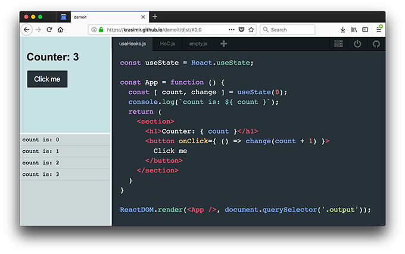
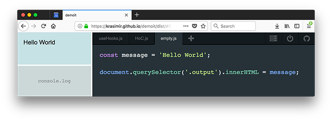

# Build your own JavaScript playground

Last couple of days I worked on my own JavaScript playground called [Demoit](https://krasimir.github.io/demoit/dist/). Something like [CodeSandbox](https://codesandbox.io), [JSBin](https://jsbin.com) and [Codepen](http://codePen.io). I already [blogged](http://krasimirtsonev.com/blog/article/my-new-and-shiny-too-for-live-demos-demoit) about why I did it but decided to give some implementation details on how it actually happened. Everything happens at runtime in the browser so it is pretty interesting type of project.

## The goal

The JavaScript playground is a place where we can write JavaScript code and see the result of it. This means changes in a DOM tree or logs in the console. To accommodate those needs I picked a pretty standard UI.



We have two panels on the left side - one for the produced markup and one for the console logs. On the right side is the editor. Every time when we make changes to the code and _save_ it we want to see the left panels updated.

## The editor

Nope, I did not implement a whole new editor by myself. That is a ton of work. What I used is [CodeMirror](https://codemirror.net/). It is a pretty decent editor for the web. Its integration is also just a couple of lines. In fact the code that I wrote for that part is just 25 lines.

```js
// editor.js
export const createEditor = function (settings, value, onSave, onChange) {
  const container = el('.js-code-editor');
  const editor = CodeMirror(container, {
    value: value || '',
    mode:  'jsx',
    tabSize: 2,
    lineNumbers: false,
    autofocus: true,
    foldGutter: false,
    gutters: [],
    styleSelectedText: true,
    ...settings.editor
  });
  const save = () => onSave(editor.getValue());
  const change = () => onChange(editor.getValue());

  editor.on('change', change);
  editor.setOption("extraKeys", { 'Ctrl-S': save, 'Cmd-S': save });
  CodeMirror.normalizeKeyMap();
  container.addEventListener('click', () => editor.focus());
  editor.focus();

  return editor;
};
```

The constructor of CodeMirror accepts a HTML element and a set of options. The rest is just listening for events, two keyboard shortcuts and focusing the editor.

In the very first commits I put a lot of logic in here. Like for example the transpilation or reading the initial value from the local storage but later decided to extract those bits out. It is now a function that creates the editor and sends out whatever we type.

## Transpiling the code

I guess you will agree with my if I say that the majority of JavaScript that we write today requires transpilation. [Babel](https://babeljs.io) is probably the most suitable tool for the job. Not because it is the most popular transpiler but because it offers a client-side standalone processing. This means that we can import [babel.js](https://unpkg.com/babel-standalone@6.26.0/babel.js) on our page and we will be able to transpile code on the fly. For example:

```js
// transpile.js
const babelOptions = {
  presets: [ "react", ["es2015", { "modules": false }]]
}

export default function preprocess(str) {
  const { code } = Babel.transform(str, babelOptions);

  return code;
}
```

I had the editor that throws out JavaScript code in the format of a raw string. Then I had Babel which accepts the string and converts it to a valid ES5 syntax (still just a string). At this point I was ready to execute some code.

## Running JavaScript code with JavaScript

That is not something that we use every day but there is a `Function` constructor which accepts code in the format of a string. And we almost never use it because if we want to run a function we just call it. However, that is really useful in the cases where we generate code at runtime. Which is exactly the case now. Here is a short example:

```js
const func = new Function('var a = 42; console.log(a);');

func(); // logs out 42
```

The code that gets transpiled is send to the `Function` constructor and executed. Here is the lines which I used in [Demoit](https://github.com/krasimir/demoit):

```js
// execute.js
import transpile from './transpile';

export default function executeCode(code) {
  try {
    (new Function(transpile(code)))();
  } catch (error) {
    console.error(error);
  }
}
```

The try-catch block here is necessary because we want to keep the app running even if there is an error. And it is absolutely fine to get some errors because this is a tool that we use for trying stuff. Notice that the script above catches syntax errors but also errors that happen while executing the code.

## Producing markup as a result

There is no much of a work for the app here. I just had to provide a DOM element and let the developer knows about it. In the case of [Demoit](https://github.com/krasimir/demoit) I placed a `<div>` with class `"output"`.

Look at the following screenshot. It illustrates how we can target the top-left panel:



The code that comes from CodeMirror is executed in the context of the same page where the app runs. So the code has access to the same DOM tree.

There was one problem that I had to solve though. It was about cleaning the `<div>` before running the code again. This was necessary because there may be some elements from the previous run. A simple `element.innerHTML = ''` didn't work properly with React so I ended up using the following:

```js
async function teardown() {  
  const output = el('.output');

  if (typeof ReactDOM !== 'undefined') {
    ReactDOM.unmountComponentAtNode(output);
  }

  output.innerHTML = '';
}
```

If the code uses `ReactDOM` package then we make the assumption that the React app is rendered in the exact that `<div>` and we unmount it. If we don't do that we'll get a runtime error because we flushed the DOM elements that React is using. On the other side `unmountComponentAtNode` is pretty resilient and does not care if there is React in the passed element or not. It just does its job if it can.

## Catching the logs

While we code we very often use `console.log`. I needed to catch those calls and show them on the lower left panel. I picked a little bit hacky solution - overwriting the console methods:

```js
const add = something => {
  // ... add a new element to the panel
}
const originalError = console.error;
const originalLog = console.log;
const originalWarning = console.warn;
const originalInfo = console.info;
const originalClear = console.clear;

console.error = function (error) {
  add(error.toString() + error.stack);
  originalError.apply(console, arguments);
};
console.log = function (...args) {
  args.forEach(add);
  originalLog.apply(console, args);
};
console.warn = function (...args) {
  args.forEach(add);
  originalWarning.apply(console, args);
};
console.info = function (...args) {
  args.forEach(add);
  originalInfo.apply(console, args);
};
console.clear = function (...args) {
  element.innerHTML = '';
  originalClear.apply(console, args);
};
```

Notice that I kept the usual behavior so I didn't break the normal work of the `console` object. I also overwrote `.error`, `.warn`, `.info` and `.clear` so I provide a better developer experience. If everything is listed in the panel the developer doesn't have to use the browser's dev tools.

## All together

There is also some glue code, some code for splitting the screen, some code that deals with the navigation and local storage. The bits above were the most interesting and tricky ones and probably the ones that you have to pay attention to. If you want to see the full source code of the playground go to [github.com/krasimir/demoit](https://github.com/krasimir/demoit). You can try a live demo [here](https://krasimir.github.io/demoit/dist/).