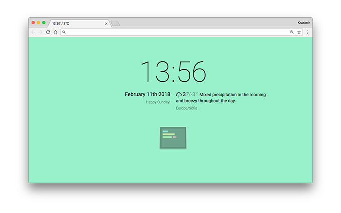
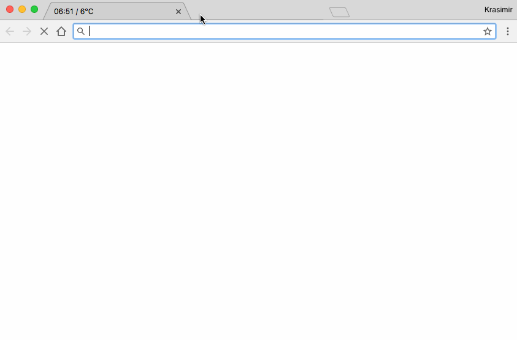

# Meet Evala (Евала) - your terminal in the browser

On my machine I have four applications always open - VSCode, Chrome, iTerm and Slack. I spend most of my time in Chrome and VSCode. My editor is full with awesome extensions and I feel pretty good there. What I am doing for the browser is making sure that I have fewer tabs open and install only extensions that I really use. One thing though I can achieve so far. I can't find the perfect [new tab extension](https://developer.chrome.com/extensions/override).

I tried the most famous ones - [Momentum](https://chrome.google.com/webstore/detail/momentum/laookkfknpbbblfpciffpaejjkokdgca), [Currently](https://chrome.google.com/webstore/detail/currently/ojhmphdkpgbibohbnpbfiefkgieacjmh), [ZenTab](https://chrome.google.com/webstore/detail/zen-tab-beautiful-simple/lbhkibbnhbkppaidinikfepgfhegmoak?hl=en) and a couple of others. My main goal was simplicity, seeing the time and the forecast plus maybe a TODO list or a notebook. All the options that I tried look good but some of them provide a little bit more features then I wanted. Those which were simple didn't completely match with my requirements. So, I am a programmer and I thought why not reinvent the wheel again. Because is fun and because I wanted different I created [Evala](https://github.com/krasimir/evala) - a web app that is available as new-tab extension for [Firefox](https://addons.mozilla.org/en-US/firefox/addon/evala/) or [Chrome](https://chrome.google.com/webstore/detail/evala/bmaojegjknddmkhfbkhfijcblmamgino).



It shows the time, it shows the weather forecast from [DarkSky](https://darksky.net) and opens my shell right there, in the browser. Not like there are no extensions that provide the same but what I wanted was really these three things - clock, forecast and terminal.

Of course we can't fully implement the last bit without little help from the outside. That is why there is a [npm package called `evala`](https://www.npmjs.com/package/evala). Once installed we have an `evala` command available.

```
> npm install evala -g
> evala --shell=$SHELL
```

`--shell=$SHELL` argument is important because otherwise we will end up using just `bash` (or `cmd.exe` under windows).

The `evala` command starts a web server that listens on `9788` port. In fact the whole app is available at http://0.0.0.0:9788 and we can open it as a regular web page (no need to install the browser extension).

When we open the app the browser connects to `9788` port and gets an access to a spawn shell and basically provide the same experience.



Let me talk a little bit about what I used.

## The front-end

The front-end part is made in [React](https://github.com/krasimir/react-in-patterns) by using [Stent](https://github.com/krasimir/stent) for data flow and state management. [XTerm.js](https://xtermjs.org/) provides the shell and to be honest is the best option for such kind stuff. Even VSCode uses it internally. I had some wonderings how to actually make it work but the demo of the project helped me a lot. The easiest way is to use the [`attach` addon](https://xtermjs.org/docs/api/addons/attach/) which is basically saying "Please, send whatever the user types to _this_ socket and pipe the stdout from the actual shell in here".

```
socket = new WebSocket(...);
socket.onopen = () => {
  term.attach(socket);
};
```

As long as the `evala` process is running, there is an open socket and the terminal replication works.

## The back-end

On the server side we have a small [Express](https://expressjs.com/) server that serves the bundled app as a static resource at http://0.0.0.0:9788. We also have [express-ws package](https://www.npmjs.com/package/express-ws) that provides web sockets support and [node-pty](https://www.npmjs.com/package/node-pty) that forks processes with pseudoterminal file descriptors. The rest was just wiring:

```
// opening a spawned terminal
let term = pty.spawn(shell, [], {
  name: 'xterm-color',
  cwd: process.env.PWD,
  env: process.env
});

// getting the stdout of the terminal and sending through the socket to the client
term.on('data', function (data) {
  ws.send(data);
});

// getting the user's input and sending to the spawned terminal
ws.on('message', function (msg) {
  term.write(msg);
});
```

It works pretty well I would say. All the key mappings and stuff are just like in my iTerm. The aliases and setup are also the same. Overall [XTerm.js](https://xtermjs.org/) and [node-pty](https://www.npmjs.com/package/node-pty) play well together

## Final words

I have several points in my TODO list. Like for example add a screen split so we have multiple terminals in one place. Fixing some bugs around key mappings and add some new once to switch between terminals. I'll be happy if you try the app ([Firefox](https://addons.mozilla.org/en-US/firefox/addon/evala/) or [Chrome](https://chrome.google.com/webstore/detail/evala/bmaojegjknddmkhfbkhfijcblmamgino)) and let me know what you think. The code is of course free and published on GitHub - [github.com/krasimir/evala](https://github.com/krasimir/evala).
