# Debugging your front-end like is 2019

_(If you are lazy jump to [this](#todomvc-done-with-react-redux-and-redux-saga) section to learn what is this article all about.)_

Remember [The Island](https://en.wikipedia.org/wiki/The_Island_(2005_film%29) movie from 2005. I watched it again these days and I realized that there is something which really entertains me in the old sci-fi titles. It is funny how they create a world of flying vehicles and say something like _"The year is 2019 ..."_. Well, we are 2018 and the public transport is still on the ground. We still can't clone people (I hope so) or travel in a giant spaceship which looks like a fully-functional city.


Then I started thinking about the people that create those movies. How cool and exciting is to think about the future and try to visualize it. This is what we are going to do in this article. We will try to create a tool that will be used by a generation of developers. A tool that these future people will find funny and incomplete.

## The script

Let's say that we want to make a HTTP request and render the users in our system. It is 2019 and we use some kind of a framework that abstracts basic data and [DOM manipulations](http://krasimirtsonev.com/blog/article/Convert-HTML-string-to-DOM-element). Like for example:

```
const App = {
  state: {
    error: null,
    users: []
  },
  setState(newState) {
    this.state = newState;
    this.render();
  },
  render() {
    document.body.innerHTML = `We have ${ this.state.users.length } users loaded.`;
  }
}

App.render();
```

Our `App` has a state where we will store the data (`users`) and if something goes wrong an `error`. To update the state we will be using `setState` method which will update the page's content. The last method `render` is simply filling the `<body>` element with the desired message.

Now let's load some data and render it on the page. There is a nice service for writing such small apps at [jsonplaceholder.typicode.com](https://jsonplaceholder.typicode.com). It is a fake publicly available REST API. We will query the `/users` endpoint like so:

```
const endpoint = 'https://jsonplaceholder.typicode.co';
const App = {
  state: {
    error: null,
    users: []
  },
  setState(newState) {
    this.state = newState;
    this.render();
  },
  render() {
    if (this.state.error) {
      document.body.innerHTML = this.state.error;
    } else if (this.state.users.length > 0) {
      document.body.innerHTML = `We have ${ this.state.users.length } users loaded.`;
    }
  },
  loadItems() {
    fetch(`${ endpoint }/users`)
      .then(
        users => users.json(),
        error => this.setState({ error: 'Ops!', users: [] })
      )
      .then(users => this.setState({ error: null, users }));
  }
}

App.loadItems();
```

Our `App` looks a little bit like a thing right. It fetches data from an endpoint, handles errors and renders result. It is ready to be tested. I loaded that code in a [Codepen](https://codepen.io/krasimir/pen/BJPBGM?editors=0010) and I was expecting the users to show up. However, the result was `Ops!` and the following error in the console:

```
Uncaught (in promise) TypeError: Cannot read property 'length' of undefined
    at Object.render (VM8889 pen.js:28)
    at Object.setState (VM8889 pen.js:20)
    at VM8889 pen.js:46
    at <anonymous>
```

It is not working, we _have no idea why_ and have to debug it.

## Debugging nowadays

Nowadays we have the luck to work with browsers that come with an awesome developer tools built in. For example the debugger or Chrome is pretty nice. We may set a breakpoint in the `loadItems` and follow step by step the script execution. This approach helps indeed but very often turns into a tricky process. If we use something like React or Angular the debugger goes into internals of those frameworks and finding what we need gets difficult. Another really cheap option is to place `console.log`s here and there and run the whole thing one more time. I know that we are all doing it often so let's add `console.log` in the `render` method:

```
render() {
  console.log('render', this.state)
```

We will get `render` followed by the current state of the app. Here is the result:

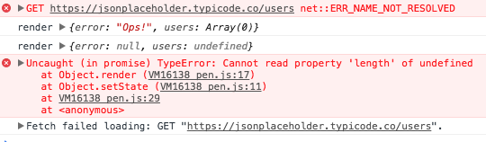

* The first and the last lines show us that the request to the API failed and if we read them carefully we will see that there is a missing `m` at the end of the URL. Should end with `com` not `co`. So this is where our problem comes from. But if that is the case then why we get `Cannot read property 'length' of undefined` error in the console. We were suppose to handle such errors. Continue reading.
* The second line indicates rendering with an error set in and empty array for `users`. This is correct and it is where our logic should stop.
* However, we have the third line where we render again but with no error and `undefined` set to `users`

Not enough `console.log`s. Let's add one more in the `setState` function. The result is:


Now we see that `setState` is fired twice after the call of `loadItems`.

```
loadItems() {
  fetch(`${ endpoint }/users`)
    .then(
      users => users.json(),
      error => this.setState({ error: 'Ops!', users: [] })
    )
    .then(users => this.setState({ error: null, users }));
}
```

We see those two calls and we can make the conclusion that the second `then` is also fired. This explains why `users` is set to `undefined` and `error` to `null`. The bug comes from the fact that if we have chained `then`s they are always executed no matter what. For example:

```
Promise.reject('Ops!')
  .then(
    () => console.log('success'),
    error => console.log(error)
  )
  .then(() => console.log('bar'))
```

It prints out `Ops!` and then `bar` even though we have a function for handling the rejected promise. To fix that we have to move the second `then` inside the first one.

```
loadItems() {
  fetch(`${ endpoint }/users`)
    .then(
      users => users.json().then(users => this.setState({ error: null, users })),
      error => this.setState({ error: 'Ops!', users: [] })
    );      
}
```

This will result in a proper error handling.

## A better debugging experience

I am doing programming for roughly [10 years](http://krasimirtsonev.com/#bio) and more or less I am following the same debugging patterns. There are questions which I ask myself and when I find the answers I am able to solve the bug.

* What exactly happened and in what order? - the answer of this question is list of events.
* How is my application state/data changed based on those events?

Answering on only one of these questions is not enough. The combination of them helps me visualize how the application worked. Otherwise the picture is not complete.

For the first time after so many years of writing code I saw a tool that kind of answers on my questions quickly without much effort from my side. That is the  [redux-devtools](https://github.com/gaearon/redux-devtools) browser extension.

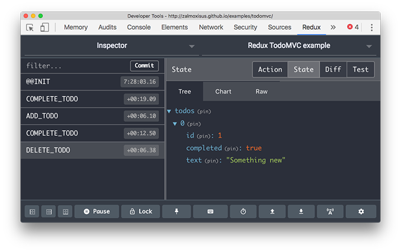

We have two panels. The left one answers on my first question showing what happened and in what order. The one on the right shows the application state corresponding to an event from the left side. We are also able to see details for the event and the diff that this event applied to the state. This is basically what I need to restore the user journey.

[redux-devtools](https://github.com/gaearon/redux-devtools) is awesome. It helped me work faster. The thing is that it is Redux related. Unfortunately we have bunch of other stuff going on. [At work](https://www.antidote.me/) we have several big progressive apps that use [redux-saga](https://redux-saga.js.org/) and very often I need to debug those bits too. Also developing a progressive app means that our code runs on the server and the initial render happen there. All the Redux actions and saga processes are happening there first and there is no way ([yet](https://github.com/zalmoxisus/redux-devtools-extension/issues/181)) to see them via the [redux-devtools](https://github.com/gaearon/redux-devtools).

So, I came with the idea that I may try creating a similar extension but collecting information from various sources. Not only Redux. That is how [Kuker](https://github.com/krasimir/kuker) was born.

## Meet [Kuker](https://github.com/krasimir/kuker)

My solution is simple and basically consist of two parts:

* A Chrome extension with two panels where the left one answers "What happened and in what order?" question while the one on the right talks about application state and how it mutates. What exactly is "state" depends on what events we send. For Redux this is the data in the store, for React it is the component tree, for the DOM is the HTML elements.
* A collection of short scripts that monitor the application and inform the extension. I call them [emitters](https://github.com/krasimir/kuker#emitters).

_(The Chrome extension may be installed from [here](https://chrome.google.com/webstore/detail/glgnienmpgmfpkigngkmieconbnkmlcn). The available emitters are listed [here](https://github.com/krasimir/kuker#emitters).)_

To demonstrate how everything works we will use the example above. We will write a custom emitter that will communicate with the extension.

## Writing a custom emitter

In order to send a message to Kuker's DevTools UI we have to do one thing - calling of `window.postMessage` function. It is a [standard API](https://developer.mozilla.org/en-US/docs/Web/API/Window/postMessage). Like for example:

```
window.postMessage({
  kuker: true,
  type: 'SOMETHING_HAPPENED',
  state: { foo: 'bar' }
}, '*');
```

`kuker: true` and `type` are mandatory properties. I added this five lines to a [Codepen](https://codepen.io/krasimir/pen/KZxWEo?editors=0010) and the result is as follows:

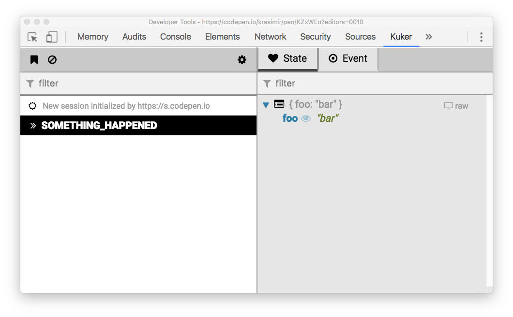

Now let's say that something else happened and our application state is changed a little bit. Let's emit a `HELLO` event where `foo` is equal to `Hello world!`.

window.postMessage({
  kuker: true,
  type: 'HELLO',
  state: { foo: 'Hello world!' }
}, '*');

Kuker now shows two events and when focusing on the second one we see the exact mutation of the state.

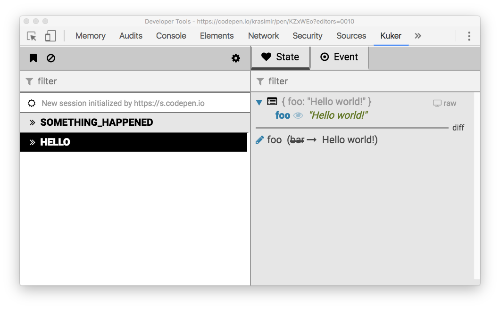

The gray theme may be boring so let's make it a little bit prettier:

```
window.postMessage({
  kuker: true,
  type: 'SOMETHING_HAPPENED',
  label: 'Something happened in our application',
  state: { foo: 'bar' },
  icon: 'fa-check-square',
  color: '#bada55'
}, '*');
window.postMessage({
  kuker: true,
  type: 'HELLO',
  label: `Someone said 'Hello'`,
  state: { foo: 'Hello world!' },
  icon: 'fa-smile-o',
  color: '#c3d0e5'
}, '*');
```

Adding proper `label`, `icon` and `color` made it look like:

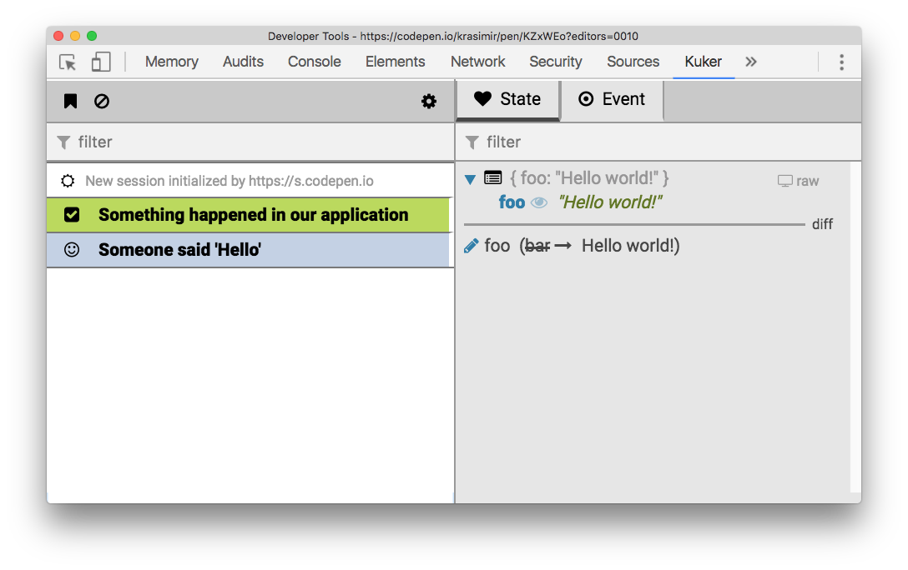

Nice. Now let's write an emitter that will be used in our example. Remember how we `console.log` in `render` and `setState` methods. Those logs will be replaced with [Kuker](https://github.com/krasimir/kuker) events.

```
const emit = function (type, state) {
  window.postMessage({
    kuker: true,
    type,
    state,
    icon: 'fa-hand-o-right',
    color: '#8cc8ea'
  }, '*');
}

const endpoint = 'https://jsonplaceholder.typicode.com';
const App = {
  state: {
    error: null,
    users: []
  },
  setState(newState) {
    this.state = newState;
    emit('SET_STATE', this.state);
    this.render();
  },
  render() {
    emit('RENDER', this.state);
    ...
  },
  loadItems() {
    emit('LOAD_ITEMS', this.state);
    ...
  }
}

App.loadItems();
```

[Codepen](https://codepen.io/krasimir/pen/KZxWEo?editors=0010)

If everything works as expected we should see `LOAD_ITEMS` followed by `SET_STATE` and `RENDER`.

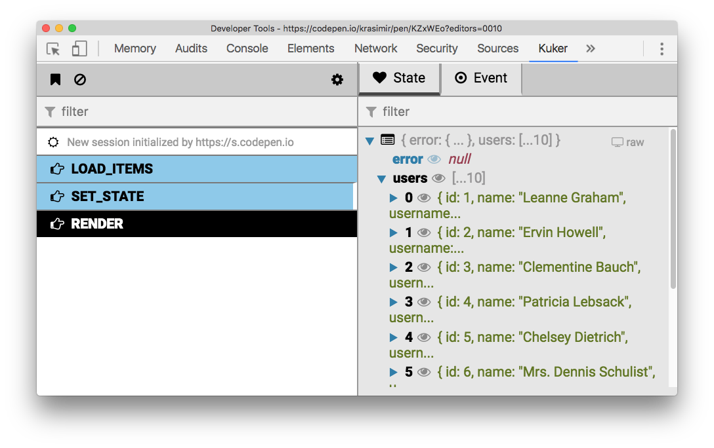

Of course this is silly example and what we see in Kuker is not so beneficial. Let's move on and see how Kuker works when we have a complex app and there are couple of emitters in the game.

## TodoMVC done with React, Redux and redux-saga

I forked a [repository](https://github.com/philmein/todomvc-react-redux-saga) that implements [TodoMVC](http://todomvc.com/) using [React](https://reactjs.org/), [Redux](https://redux.js.org/) and [redux-saga](https://redux-saga.js.org/). It's a fairly complex app having couple of user journeys so I always like to use it as an example. The source code which is deployed [here](http://work.krasimirtsonev.com/git/redux-react-saga-todomvc) is available at [github.com/krasimir/todomvc-react-redux-saga](https://github.com/krasimir/todomvc-react-redux-saga) and you can browse it to see the integration of Kuker's emitters. They are three:

* [React emitter](https://github.com/krasimir/kuker#integration-with-react) - [here](https://github.com/krasimir/todomvc-react-redux-saga/blob/master/src/app.js)
* [Redux emitter](https://github.com/krasimir/kuker#integration-with-redux) - [here](https://github.com/krasimir/todomvc-react-redux-saga/blob/master/src/config/store.js)
* [redux-saga emitter](https://github.com/krasimir/kuker#integration-with-redux-saga) - [here](https://github.com/krasimir/todomvc-react-redux-saga/blob/master/src/config/business-logic.js)

You may install the extension from the [Chrome's web store](https://chrome.google.com/webstore/detail/glgnienmpgmfpkigngkmieconbnkmlcn) and open [this url](http://work.krasimirtsonev.com/git/redux-react-saga-todomvc). Start using the app and in the DevTools tab of Kuker you will see a picture like this:


In here we see events coming from all the three emitters. The rows that start with a number like `#67` are saga effects. That is actually the id of the saga. Next to that number, on the right side there is another one which is showing the id of the parent saga. We do see two Redux actions `CREATE_NEW_TODO` and `TODOS/INSERT`. At the end of the screenshot are listed React `Update` event and a mounting of one new component.

Let's play with the extension and see what can offer to us.

### Filtering

There is a small gear at the top of the left panel. It brings a list of all the event types dispatched to the extension and we are able to filter out the once that are not relevant to us. For example, if we want to see only the Redux onces:

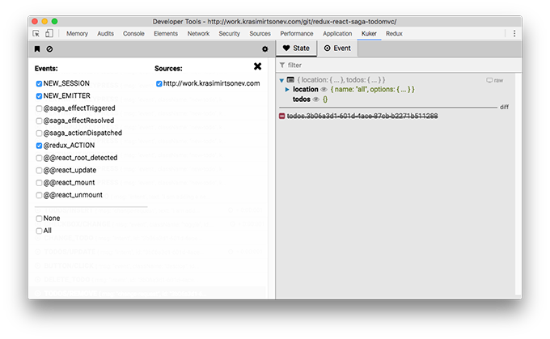

Also notice that together with the event types we may filter the sources. Usually we have only one but if we server-side render this app we will get node as a source too. The Kuker emitters check if they run in browser environment and if not they assume that it is node. Then a socket server is started which the Kuker extension is connecting to. That is how we see events from SSR phase of our application.

### Adding a marker and clearing events

At the same bar where the gear for filtering is we have two other buttons. Adding a marker and clearing the events. The marker is useful when you have lots of event coming and you want to see which are the new ones. For example we reach the point of the app and we know that after doing a certain action we will get bunch of events which will give us the information that we need. In this case we just add a marker and we know that the events after that red line are what we need.


### Monitoring the state

In the right panel by default we see the current state of the application. It shows what was the state at the time when the event is dispatched. Once we have two or more events we are able to calculate a diff between them. It appears below the state tree in a dedicated section showing the path of the changed property, the old and the new value. Additions and deletions are also captured.

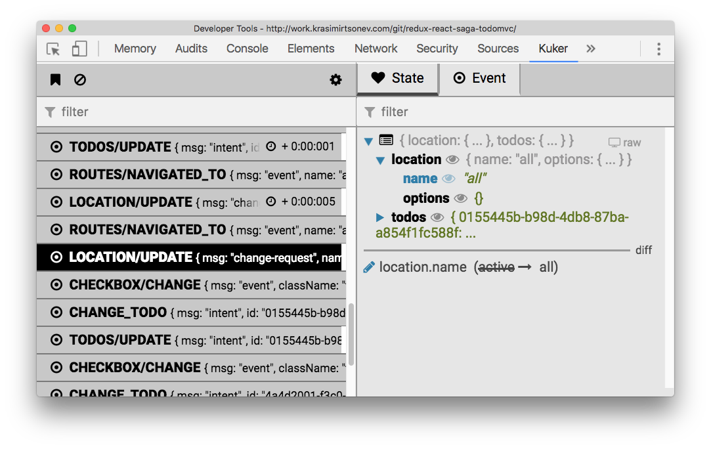

That is cool and we have it in redux-devtools. What I was missing in there is a marker that shows me which of the events are mutating state. Imagine that you have 50+ events to examine for a specific state change. We have to play them one by one to find out which amended the data. In Kuker we have a marker to support this case. It is a small white rectangle that appears on the right side of the event. Events having this marker mutated the state. However, this is not completely solving our issue because what if they all apply some data transformations. If we look closely to the state tree items we will see that every property has an eye icon next to it. By clicking it we are saying "I am interested in this bit of the state. Show me who is changing it.". Here is an example demonstrating both markers:

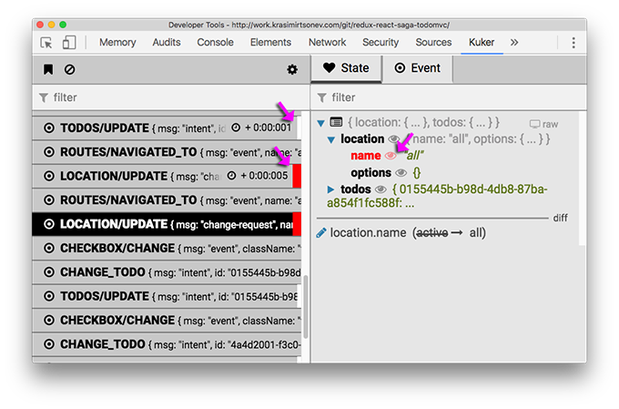

As we mentioned above, "state" for the different [emitters](https://github.com/krasimir/kuker#emitters) mean different thing. In the following screenshot we see how the currently selected event is produced by the [React emitter](https://github.com/krasimir/kuker#integration-with-react) and the right panel shows the React components which are on the page. Same as the case above, we are able to click the eye icon and see which of the events affected that part of the component tree. When displaying a HTML-like state we have additional information for every of the nodes. It appears below the tree. Like in this example we see the props of the `<App>` component.

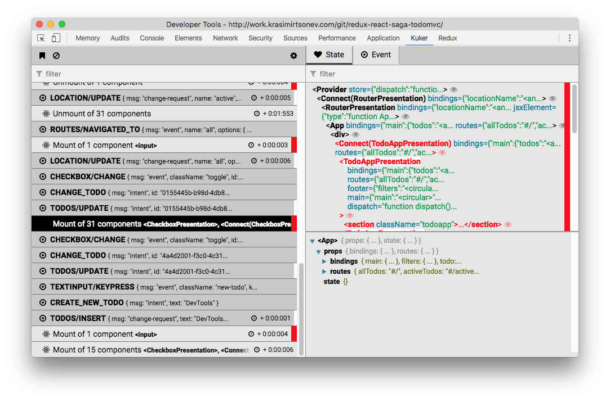

Kuker uses the same approach when displaying events coming from the [Vue](https://github.com/krasimir/kuker#integration-with-vue), [Angular](https://github.com/krasimir/kuker#integration-with-angular) and [HTML](https://github.com/krasimir/kuker#html-emitter) emitters.

### Detail view of an event

Next to the "State" tab in the right panel we have "Event". The tree that we see there displays some details about the event and the actual data send from the page.

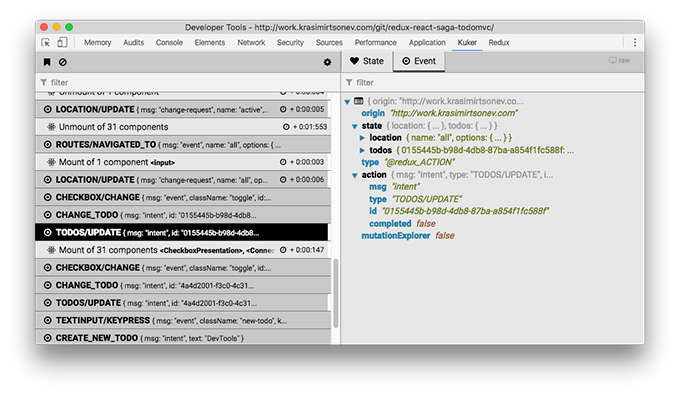

## Final words

Debugging is an important part of every developer's life. It takes a big chunk of our time and it should be a flawless experience. I strongly believe that the tools that we use while debugging should be context specific. What I mean by that is that they should display information about process and not about implementation. The source panel of Chrome's devtools for example is awesome to track what exactly happened in the JavaScript world but sometimes is way more noisy then redux-devtools. And that is fine because it targets the low level JavaScript execution while redux-devtools is targeting Redux flow. What I'm aiming by creating [Kuker](https://github.com/krasimir/kuker) is to provide a context specific debugging experience.

## Call for contributors

Please, if you are an author of a framework or library and you want to see it supported by Kuker do submit an issue in the [Kuker's repository](https://github.com/krasimir/kuker). I'll be more then happy to integrate it. What Kuker support so far is: 

* [React](https://github.com/krasimir/kuker#integration-with-react)
* [Angular](https://github.com/krasimir/kuker#integration-with-angular)
* [Vue and Vuex](https://github.com/krasimir/kuker#integration-with-vue)
* [Redux](https://github.com/krasimir/kuker#integration-with-redux)
* [redux-saga](https://github.com/krasimir/kuker#integration-with-redux-saga)
* [HTML](https://github.com/krasimir/kuker#html-emitter)
* [Stent](https://github.com/krasimir/kuker#integration-with-stent)
* [Machina.js](https://github.com/krasimir/kuker#integration-with-machinajs)
* [MobX](https://github.com/krasimir/kuker#integration-with-mobx)
* [Base emitter](https://github.com/krasimir/kuker#baseemitter)


