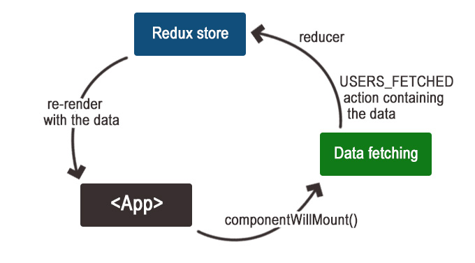

# A story about React, Redux and server-side rendering

Long long time ago in a kingdom far away there was an app. The app was supported by the well known React and Redux families but there was a problem. It was damn slow. People started complaining and the app had to do something. It had to deliver its content quickly so it provides better user experience. Then the server-side rendering was born.

Today we are going to build a simple React application that uses Redux. Then we will server-side render it. The example includes asynchronous data fetching which makes the task a little bit more interesting. We will have client-side but also server-side JavaScript.

## Setup

Before even starting with React we have to deal with some setup. We want to write our code using ES6 syntax which means that our code needs to be transpiled to ES5 before to be used. Transpilation is one of the things but we also need to bundle it. I already blogged on that topic some time ago - [
The bare minimum to work with React](http://krasimirtsonev.com/blog/article/The-bare-minimum-to-work-with-React). The approach that we will take in this article is similar. We will use [browserify](https://www.npmjs.com/package/browserify) and [watchify](https://www.npmjs.com/package/watchify) with [babelify](https://www.npmjs.com/package/babelify) transform to bundle our client side code. For our server side code we will directly rely on [babel-cli](https://babeljs.io/docs/en/babel-cli). 

Having the following file structure

```
build
src
  ├── client
  │   └── client.js
  └── server
      └── server.js
```

we need these two scripts to build and develop the project.

```
"scripts": {
    "build": "
      browserify ./src/client/client.js -o ./build/bundle.js -t babelify &&
      babel ./src/ --out-dir ./build/",
    "watch": "
      concurrently 
        \"watchify ./src/client/client.js -o ./build/bundle.js -t babelify -v\"
        \"babel ./src/ --out-dir ./build/ --watch\"
      "
}
```

*(Notice that I added the new lines and spaces for easy reading)*

[concurrently](https://www.npmjs.com/package/concurrently) library helps running more then one process in parallel which is exactly what we need when watching for changes.

There is one last script that we need. The one that runs our HTTP server.

```
"scripts": {
  "build": "...",
  "watch": "...",
  "start": "nodemon ./build/server/server.js"
}
```

Instead of just `node ./build/server/server.js` we will use [nodemon](https://nodemon.io/). Nodemon is an utility that will monitor for any changes in our code and it will automatically restart the server.

## React + Redux application

Let's say that we have an endpoint that returns data for the users in our system in the following format:

```js
[
  {
    "id": <number>,
    "first_name": <string>,
    "last_name": <string>,
    "avatar": <string>
  },
  {
    ...
  }
]
```

And our task is to get that data and render it. To keep the example simple we will do that with a single `<App>` component. In the `componentWillMount` lifecycle method we will trigger the data fetching and once the request succeeds we will dispatch an action with type `USER_FETCHED` which will lead to an update in the our Redux store. This will trigger a re-rendering of our component with the given data.



### Implementing the Redux pattern

Let's first start by modeling our application state. The endpoint returns an array of user profiles so we may go with the following:

```js
{
  users: <array>|null
}
```

Initially `users` contains `null` and when the data arrives it gets replaced with an array of objects. The reducer that handles our `USER_FETCHED` array looks like that:

```js
// reducer.js
import { USERS_FETCHED } from './constants';

function getInitialState() {
  return { users: null };
}

const reducer = function (oldState = getInitialState(), action) {
  if (action.type === USERS_FETCHED) {
    return { users: action.response.data };
  }
  return oldState;
};
```

We also need an action creator which will be used in the `<App>` component and a selector so we can pull the `users` from the application state.

```js
// actions.js
import { USERS_FETCHED } from './constants';
export const usersFetched = response => ({ type: USERS_FETCHED, response });

// selectors.js
export const getUsers = ({ users }) => users;
```

The last bit regarding the Redux implementation is the creation of the store. We will write a simple factory function/helper for that.

```js
// store.js
import { USERS_FETCHED } from './constants';
import { createStore } from 'redux';
import reducer from './reducer';

export default () => createStore(reducer);
```

Why a factory function and not directly returning `createStore(reducer)`. That is because when we server-side render we will need an instance of the same store but it needs to be a new one for every request.

### Writing the React component (`<App>`)

We have to mention something important here. If we want to server-side render something we have to change our mindset a little bit. We have to think carefully about what our code does and is that thing possible on the server. For example, if we access the `window` object we have to rethink our component or use a wrapper because we don't have `window` on the server side. The following code is the implementation of our `<App>` component.

```js
// App.jsx
import React from 'react';
import { connect } from 'react-redux';

import { getUsers } from './redux/selectors';
import { usersFetched } from './redux/actions';

const ENDPOINT = 'http://localhost:3000/users_fake_data.json';

class App extends React.Component {
  componentWillMount() {
    fetchUsers();
  }
  render() {
    const { users } = this.props;

    return (
      <div>
        {
          users && users.length > 0 && users.map(
            // ... render the user here
          )
        }
      </div>
    );
  }
}

const ConnectedApp = connect(
  state => ({
    users: getUsers(state)
  }),
  dispatch => ({
    fetchUsers: async () => dispatch(
      usersFetched(await (await fetch(ENDPOINT)).json())
    )
  })
)(App);

export default ConnectedApp;
```

Notice that we are using `componentWillMount` and not `componentDidMount`. The main reason is because we don't have `componentDidMount` running on the server-side. *(React's team also depricated those methods but that is another story.)*

`fetchUsers` is an async function passed as a prop which uses the [Fetch API](https://developer.mozilla.org/en-US/docs/Web/API/Fetch_API) to retrieve the data from the fake endpoint. When the both promises returned by `fetch()` and `json()` functions are resolved we dispatch the `USERS_FETCHED` action. Later the reducer picks it up and returns the new state containing the users' data. And because our `App` component is *connect*ed to Redux it gets re-rendered.

The client-side code ends with the placement of `<App>` component on the page.

```js
// client.js
import React from 'react';
import ReactDOM from 'react-dom';
import { Provider } from 'react-redux';

import App from './App.jsx';
import createStore from './redux/store';

ReactDOM.render(
  <Provider store={ createStore() }><App /></Provider>,
  document.querySelector('#content')
);
```

## Running the Node server

The most trivial approach for running a HTTP server in JavaScript is using [Express](https://expressjs.com/) library. We will use it first because it is simple and helps the purpose of this article and second because it is anyway pretty stable solution.

```js
// server.js
import express from 'express';

const app = express();

// Serving the content of the "build" folder. Remember that
// after the transpiling and bundling we have:
//
// build
//   ├── client
//   ├── server
//   │   └── server.js
//   └── bundle.js
app.use(express.static(__dirname + '/../'));

app.get('*', (req, res) => {
  res.set('Content-Type', 'text/html');
  res.send(`
    <html>
      <head>
        <title>App</title>
      </head>
      <body>
        <div id="content"></div>
        <script src="/bundle.js"></script>
      </body>
    </html>
  `);
});

app.listen(
  3000,
  () => console.log('Example app listening on port 3000!')
);
```

Having this file we may run `npm run start` and visit `http://localhost:3000`. We will see the application working. The data will be fetched and the users will be rendered.

## The server-side rendering

It all works so far but everything is happening on the client. This means that our server initially sends a blank page to the user. Then the browser needs to download `bundle.js` and runs it. Once the data fetching happens we show the result to the user. And here is where the server-side rendering comes in to the game. Instead of leaving all the work for the browser we may do everything on the server and send the final markup. And then React is smart enough to understand the markup that is currently on the page and reuse it.

The API of React that we have to use in node is delivered by the [react-dom](http://npmjs.com/package/react-dom) package. Remember how on the client we did the following:

```js
import ReactDOM from 'react-dom';

ReactDOM.render(
  <Provider store={ createStore() }><App /></Provider>,
  document.querySelector('#content')
);
```

Well, on the server is almost the same.

```js
import ReactDOMServer from 'react-dom/server';

const markupAsString = ReactDOMServer.renderToString(
  <Provider store={ store }><App /></Provider>
);
```

We use the same `<App>` component and the same store. It is just a different React API that returns a string instead of rendering into a DOM element. Later we inject that string in our Express response and the user receives some server-side rendered markup. So our `server.js` changes to:

```js
const store = createStore();
const content = ReactDOMServer.renderToString(
  <Provider store={ store }><App /></Provider>
);

app.get('*', (req, res) => {
  res.set('Content-Type', 'text/html');
  res.send(`
    <html>
      <head>
        <title>App</title>
      </head>
      <body>
        <div id="content">${ content }</div>
        <script src="/bundle.js"></script>
      </body>
    </html>
  `);
});
```

If we restart the server and open the same `http://localhost:3000` page we will see the following response:

```html
<html>
  <head>
    <title>App</title>
  </head>
  <body>
    <div id="content"><div data-reactroot=""></div></div>
    <script src="/bundle.js"></script>
  </body>
</html>
```

We do have some content inside our container but it is just `<div data-reactroot=""></div>`. This doesn't mean that something is broken. It is absolutely correct. React indeed renders our page but it renders only the static content. In our `<App>` component we have nothing until we get the data and on the server we simply don't give enough time for all this to happen. The fetching of the data is an asynchronous process and we have to take this into account when we render. And this is where the server-side rendering becomes tricky. It really boils down to what you application is doing. In our example the app depends on one specific request but this could be many requests or maybe a completed root saga if [redux-saga](https://redux-saga.js.org/) library is used. I recognize two ways of dealing with the problem:

* We know exactly what the requested page needs. We fetch the data and create the Redux store with that data. If we render with already fulfilled store we will get rendering of the full page.
* We rely completely on the code that runs on the client and we wait till everything there is complete.

The first approach requires some level of routing and it means that we have to manage the data fetching on two different places. The second approach means that we have to be careful with what we do on the client and make sure that the same thing may happen on the server.


