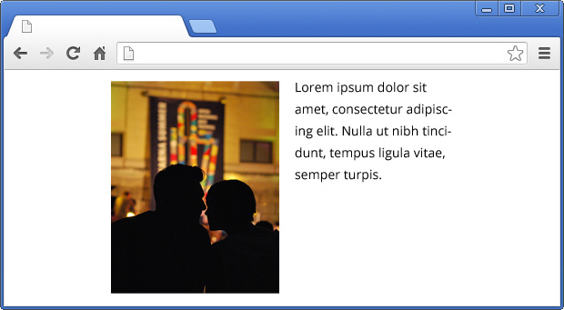

# CSS Challenge #2: Layouting 

The [first solved challenge](http://krasimirtsonev.com/blog/article/CSS-Challenge-1-expand-and-center-image-fill-div), was something which rankle me a lot. The next one is actually a well known common task, but it is still difficult sometimes. In every project we have different types of layouts. Of course there are some patterns. The idea today is to implement them with pure CSS.

## Layout A - everything centered

That's maybe the most simplest layout. Usually the markup is something like that:

	

	    
	    
...

	

As you know, if you have container with elements which are inline objects, you could use *text-align: center* to position them in the middle. If you apply this to our wrapper the image will be centered, because it is by default an inline element. Also the text in the paragraph will be centered, because the *&lt;p&gt;* tag inherits the *text-align* from its parent. However our layout is a bit different. First of all the image and the paragraph should be with equal widths. The text should be left aligned and will be nice if we could apply the same CSS with different widths of the container.

Let's imagine that we don't know the width of the image. This means that we can't also set the width of the paragraph. So, we should simply rely on the parent element. By default the *&lt;p&gt;* tag is a block element so its width is 100%. If we apply the same value to the *&lt;img&gt;* tag they will be with equals widths. 

Because we know the wrapper's width we could use *margin: 0 auto* to position it in the center. At the end we should apply *text-align: left* to the paragraph so its text sticks to the left. The final CSS of the layout is:

	.layout-a {
	    width: 360px;
	    margin: 0 auto;
	    text-align: center;
	}
	.layout-a img {
	    width: 100%;
	}
	.layout-a p {
	    text-align: left;
	}

Here is a simple example to play with:

<iframe width="100%" height="300" src="http://jsfiddle.net/krasimir/xZR8D/16/embedded/result,css,html/" allowfullscreen="allowfullscreen" frameborder="0"></iframe>

## Layout B - 

## Layout C - 

## Layout D - 

