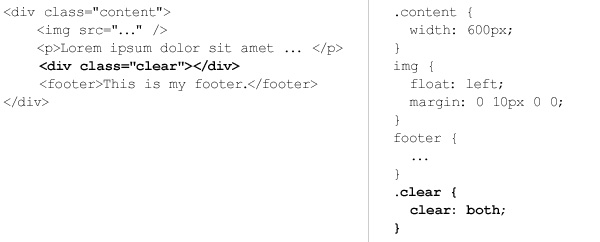

# CSS: using float property

*float* property is one of those CSS rules which are somehow difficult to understand. Before a couple of days I had a problem with floating divs. I solved it and decided to write an article about the solution. The article contains some basics for the floating.[STOP]

## Basic usage

The main function of the *float* property is to make the content floats around an element. I.e. if you need a text wrapping an image you should set *float* to the image. For example:

And the result is:
<pre class="codepen" data-height="200" data-type="result" data-href="kzDCn" data-user="krasimir" data-safe="true"><code></code><a href="http://codepen.io/krasimir/pen/kzDCn">Check out this Pen!</a></pre>

There are four possible values of *float* - *left*, *right*, *none* (default) and *inherit*. I think that they are self-explanatory.

What you should remember is that the floating continue until you clear it. In other words, no matter how many elements you add they will still wrap the floated block. In the example below the *&lt;footer>* element should be below the image, but because there is no clearing it looks like that:

<pre class="codepen" data-height="200" data-type="result" data-href="aotvE" data-user="krasimir" data-safe="true"><code></code><a href="http://codepen.io/krasimir/pen/aotvE">Check out this Pen!</a></pre>

## Clearing 

There are mainly two ways to clear the floating. Adding an empty block element which has *clear* property set:

The other way is to use pseudo class *after*.

And the result is:
<pre class="codepen" data-height="240" data-type="result" data-href="Fjtrs" data-user="krasimir" data-safe="true"><code></code><a href="http://codepen.io/krasimir/pen/Fjtrs">Check out this Pen!</a></pre>

## Navigation composition
Very often the *float* property is used for building navigation. I.e. a lot of front-end developers use unordered list with all its elements floated. For example:
<pre class="codepen" data-height="200" data-type="css" data-href="JHFAq" data-user="krasimir" data-safe="true"><code></code><a href="http://codepen.io/krasimir/pen/JHFAq">Check out this Pen!</a></pre>
 

## Layout composition
*float* is used in most frameworks for layout composition. It's easy to define content blocks and arrange them. For example here is three column layout:
<pre class="codepen" data-height="300" data-type="result" data-href="bnusq" data-user="krasimir" data-safe="true"><code></code><a href="http://codepen.io/krasimir/pen/bnusq">Check out this Pen!</a></pre>

Another common pattern is to style a page component. Let's say that you have a user account teaser:
<pre class="codepen" data-height="300" data-type="result" data-href="rozJx" data-user="krasimir" data-safe="true"><code></code><a href="http://codepen.io/krasimir/pen/rozJx">Check out this Pen!</a></pre>

## Problems
There are tons of great articles that explain the most common problems regarding *float* property. I don't think that I'll describe them in a better way so I'll suggest to read [this article](http://css-tricks.com/all-about-floats/) or for example check out [here](http://alistapart.com/article/css-floats-101). I think that most of the troubles in the usage of that css style are connected to the fact that the developer doesn't know how the floating works. Of course there are cases where the bugs are because of the used browser or forgotten *clear* element. What I wanted to share is actually a problem that I had. Here is my layout - it's just a list of info boxes and the idea is to have three per row:
<pre class="codepen" data-height="420" data-type="result" data-href="wIHzJ" data-user="krasimir" data-safe="true"><code></code><a href="http://codepen.io/krasimir/pen/wIHzJ">Check out this Pen!</a></pre>

The problem occurs once some of the elements has more text. All the boxes are floated to the left, but because the second one has a lot of text, its height is more than expected the result is not very good. I tried several solutions, but none of them were flexible enough. I had to find some trick to put *clear: both* after every third element. Of course I didn't know the actual number of elements, I didn't want to use javascript or set custom css classes. Then I realized that *nth-child* selector will do the job:

	.info-box:nth-child(3n+4) {
		clear: both;
	}

<pre class="codepen" data-height="400" data-type="result" data-href="xydDr" data-user="krasimir" data-safe="true"><code></code><a href="http://codepen.io/krasimir/pen/xydDr">Check out this Pen!</a></pre>

