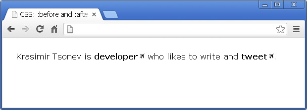

# CSS: :before and :after pseudo elements in practice

By definition *:before* and *:after* are [CSS](http://krasimirtsonev.com/blog/category/CSS3) pseudo elements. You can use them to insert something before or after the content of an element. There are some great articles giving the basics, but I wanted to write down a blog post for the real use cases. Or, at least, to show what I'm using them for.

## Syntax

Let's say that we have the following simple html markup:

	
paragraph text

We are able to use a pseudo element like that:

	p:before {
        content: "this is ";
        font-weight: bold;
        font-style: italic;
    }

And the result is:

Have in mind that you are actually adding an element before or after the content. It's not something which appear next to the selected element, but it is related to its content.

## Icons

It is very popular to use *:before* or *:after* for displaying an icon. Because you are able to add every CSS style property, you could make the newly created element a block one and attach background image. 

Again, we have the same markup *&lt;p>paragraph text&lt;/p>* and the following CSS:

	p:before {
        content: "";
        display: block;
        background: url("icon.jpg") no-repeat;
        width: 20px;
        height: 20px;
        float: left;
        margin: 0 6px 0 0;
    }

*icon.jpg* is a 20x20 image exported from Photoshop. Here is how this looks in a browser:

## Styling external links

I saw this in a good amount of products. It is a good practice to style differently the links which point to external resources. This could be easily done with the technique above. Let's say the following paragraph of text:

	
Krasimir Tsonev is <a href="http://krasimirtsonev.com">developer</a>
	who likes to write and <a href="https://twitter.com/KrasimirTsonev">tweet</a>.

We could add a small icon after that link indicating that it points to page outside the current domain.

	a {
        text-decoration: none;
        font-weight: bold;
        color: #000;
    }
    a:after {
        content: "";
        display: inline-block;
        background: url("icon-external.jpg") no-repeat top right;
        width: 14px;
        height: 12px;
    }

## Breadcrumbs (navigation)

Usually when you do breadcrumbs you have links and separator between them. Instead of adding an element into the DOM you could achieve the same effect with pure css.

The HTML:

	

        <a href="#">Home</a>
        <a href="#">Team</a>
        <a href="#">Developers</a>
    

Just a few lines of CSS:

	a {
        text-decoration: none;
        font-weight: bold;
        color: #000;
    }
    a:after {
        content: " /";
    }
    a:first-child:before {
        content: " » ";
    }
    a:last-child:after {
        content: "";
    }

And the result is this:

There are few interesting things happening. Firstly, there is a bullet before all the links. I combined two pseudo elements *first-child* and *before* saying "Add &#187; before the first link". At the end I did the same thing to remove the separator from the last link in the list.

I found this extremely helpful. Mainly because I don't have to take care about this in the code which generates the navigation. I mean if I have to build the same thing with PHP I should write some additional code. For example:

	$links = array('Home', 'Team', 'Developers');
    $str = '» ';
    for($i=0; $i<count($links); $i++) {
        $str .= '<a href="#">'.$links[$i].'</a>';
        if($i < count($links)-1) {
            $str .= ' / ';
        }
    }
    echo $str;

I.e. in the code above I added the bullet in front of the links and some logic for the separators inside PHP. That's somehow wrong, because the PHP code should not be responsible for the look of the things.

## Clearing floats

Using *float* property is still quite popular. It helps a lot for layout organization. However, once an element is floated you need another element to clear the float. Otherwise the result is not so good. Instead of adding another DOM node you can use *:after* pseudo element.

## Examples

All the examples used in this article are available [here]().

## Resources

  - [Meet the Pseudo Class Selectors](http://css-tricks.com/pseudo-class-selectors/)
  - [Learning To Use The :before And :after Pseudo-Elements In CSS](http://coding.smashingmagazine.com/2011/07/13/learning-to-use-the-before-and-after-pseudo-elements-in-css/)