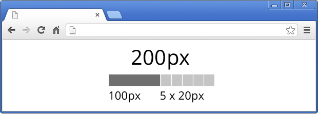

# HTML Animations (the proper way) 

Last few years designers use a lot of animations directly in the [HTML](http://krasimirtsonev.com/blog/category/HTML5). That's of course kinda cool, because you don't need a plugin in order to see their work. There are several ways to make animations in HTML. It's an interesting subject and I decided to make a short research and summarize the information.

## Basics

I spend several years in [Flash development](http://krasimirtsonev.com/blog/category/ActionScript). To make an animation there you have to generate different static images and display them in a sequence. That's how the illusion of movement is created. The same approach is valid for HTML. For example, if you have five seconds and increase the width of a DOM element five times with 20px the result will be an animation.

