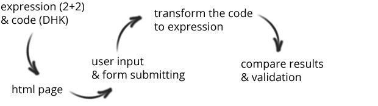
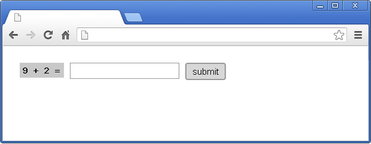
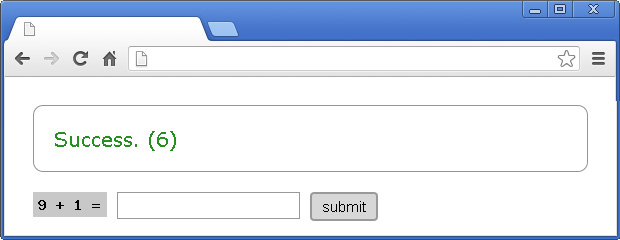

# PHP: Simple captcha 

In my company, we have a lot of WordPress sites. Some of them require contact form with captcha field. The short way for solving such task is to use a plugin. However, as you may guess, the add-ons are available for everyone, which means that they could be easily explored and probably hacked. That's why I suggested a simple, custom script, which is developed by us.[STOP]

Yes, I know that it is not the perfect solution ever, but it will stop the spam bots, because it is missing in their databases. The idea is simple - you send a math expression (like *2+2*) and secret code (like *DPH*). The user enters the result and submit the form along with the secret code. You use the code to find out what the expression was and compare the result from the user with the real once.

## Expression generation

That's the easiest part of the script. Just pick two random numbers between 0 and 9:

	$expression = (object) array(
        "n1" => rand(0, 9), 
        "n2" => rand(0, 9)
    );

To add another level of protection it is a good idea to generate an image. I mean instead of directly showing the digits in the HTML we can easily convert them to a png file and place it in *img* tag.

	function generateImage($text, $file) {
        $im = @imagecreate(74, 25) or die("Cannot Initialize new GD image stream");
        $background_color = imagecolorallocate($im, 200, 200, 200);
        $text_color = imagecolorallocate($im, 0, 0, 0);
        imagestring($im, 5, 5, 5,  $text, $text_color);
        imagepng($im, $file);
        imagedestroy($im);
    }
    $captchaImage = 'captcha/captcha'.time().'.png';
    generateImage($expression->n1.' + '.$expression->n2.' =', $captchaImage);
    ...
    ...
    ...
	<form method="post" action="index.php">
        <input type="hidden" name="code" value="" />
        " />
        <input type="text" name="result" />
        <input type="submit" value="submit" />
    </form>

At the end the form looks like that:

## Code generation

Ok, there are two numbers and we have to somehow transform them to a secret code. I used alphabet. Every digit from 0 to 9 has its own letter:

	$alphabet = array('K', 'g', 'A', 'D', 'R', 'V', 's', 'L', 'Q', 'w');
    $code = $alphabet[$expression->n1].$alphabet[$expression->n2];

To make the things a little bit more difficult I decided to use ten alphabets. I.e. at the end the code contains three letters. The first one represents the used alphabet and the others the generated numbers.

	$alphabet = array('K', 'g', 'A', 'D', 'R', 'V', 's', 'L', 'Q', 'w');
    $alphabetsForNumbers = array(
        array('K', 'g', 'A', 'D', 'R', 'V', 's', 'L', 'Q', 'w'),
        array('M', 'R', 'o', 'F', 'd', 'X', 'z', 'a', 'K', 'L'),
        array('H', 'Q', 'O', 'T', 'A', 'B', 'C', 'D', 'e', 'F'),
        array('T', 'A', 'p', 'H', 'j', 'k', 'l', 'z', 'x', 'v'),
        array('f', 'b', 'P', 'q', 'w', 'e', 'K', 'N', 'M', 'V'),
        array('i', 'c', 'Z', 'x', 'W', 'E', 'g', 'h', 'n', 'm'),
        array('O', 'd', 'q', 'a', 'Z', 'X', 'C', 'b', 't', 'g'),
        array('p', 'E', 'J', 'k', 'L', 'A', 'S', 'Q', 'W', 'T'),
        array('f', 'W', 'C', 'G', 'j', 'I', 'O', 'P', 'Q', 'D'),
        array('A', 'g', 'n', 'm', 'd', 'w', 'u', 'y', 'x', 'r')
    );
    $usedAlphabet = rand(0, 9);
    $code = $alphabet[$usedAlphabet].
            $alphabetsForNumbers[$usedAlphabet][$expression->n1].
            $alphabetsForNumbers[$usedAlphabet][$expression->n2];

The generated markup looks like that:

    <form method="post" action="index.php">
        <input type="hidden" name="code" value="wgm" />
        
        <input type="text" name="result" />
        <input type="submit" value="submit" />
    </form>

## Processing the result

Having all the alphabets and getting the secret code you are able to restore the expression and compare the sent result. There are two helper functions. The first one returns a number by a letter given. The second one accepts the code and returns the result of the original question sent to the user.

    // converting alphabet character to a number
    function getIndex($alphabet, $letter) {
        for($i=0; $i<count($alphabet); $i++) {
            $l = $alphabet[$i];
            if($l === $letter) return $i;
        }
    }

    // getting the original expression's result
    function getExpressionResult($code) {
        global $alphabet, $alphabetsForNumbers;
        $userAlphabetIndex = getIndex($alphabet, substr($code, 0, 1));
        $number1 = (int) getIndex($alphabetsForNumbers[$userAlphabetIndex], substr($code, 1, 1));
        $number2 = (int) getIndex($alphabetsForNumbers[$userAlphabetIndex], substr($code, 2, 1));
        return $number1 + $number2;
    }

At the end, simply get the data from the form and by using the two functions above validate the user's input.

    if(isset($_POST["code"])) {
        $sentCode = $_POST["code"];
        $result = (int) $_POST["result"];
        if(getExpressionResult($sentCode) === $result) {
            $message = '
Success.
';
        } else {
            $message = '
Failure.
';
        }
    }

If the user type the correct number the page is:

## Source code

A working example could be found here.

## Conclusion

Sure, the provided solution is not unbreakable, but you can make it complex enough, so it is difficult to be hacked. You can add more random letters at the beginning and at the end of the code. You could even add more alphabets or integrate the current time or date.
