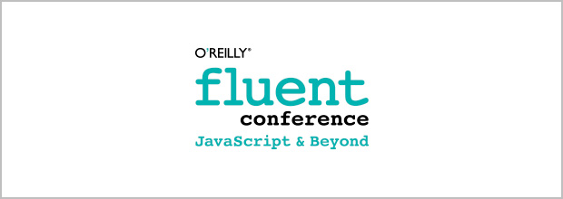

# Stay tuned / conferences that you should know about

Nowadays is really difficult to be up to date with the latest technologies, concepts or tools. There are several ways to accomplish this. You could use RSS, check blogs regularly or follow as many people as possible in Twitter/Facebook. My way is to watch videos from various conferences.[STOP]

There are few things, which I'm looking for while picking a conference to watch.

  - speakers - I know a lot of good speakers and if I see them attending in an event I know that I have to check it. That's how I found the smart people. Usually the they are, or at least have something smart to say.
  - talks - I'm interested in tech talks, but not lectures with a lot of details. I prefer to listen for a new concept or some interesting use cases. If the slides are full with complex I feel a little bit bored and normally I move to the next speaker in the list.
  - only new stuff - there are a lot of screencasts out there. It is physically not possible to watch them all. I have a simple rule - watch only those clips which are captured this or last year. Of course I have exclusions, but in general I'm trying to stick to the latest videos. 

## Front-Trends

That's maybe my favorite. Really interesting speakers, various technologies and reasonable timeframe for the talks. It's a conference happening in Europe, Poland.

Official page: [front-trends.com](front-trends.com)

Videos: [https://vimeo.com/fronttrends](https://vimeo.com/fronttrends)

## Fronteers

If you are front-end developer you should definitely check this out. The talks are around 30 min, but after that there is a nice interview with the speaker. The conference is placed in Amsterdam.

Official page: [fronteers.nl](http://fronteers.nl/)

Videos: [https://vimeo.com/fronteers](https://vimeo.com/fronteers)

## JSConf

We all see the rise of the JavaScript. Everyone is talking about it, everyone is using it. However, this conference is not only about JavaScript. It's worth checking it out.

Official page: [jsconf.com](http://jsconf.com/)

Videos: [playlists in YouTube](http://www.youtube.com/user/jsconfeu/videos?shelf_index=0&view=1&sort=dd)

## BDConf

It's an event about the new technologies, mobile web. Really helpful talks about responsive/adaptive design, modern concepts, new workflows etc ...

Official page: [bdconf.com](http://bdconf.com/)

Videos: [https://vimeo.com/bdconf](https://vimeo.com/bdconf)

## Mobilism

Mobile, mobile, mobile ... Nowadays everything is around those mobile devices. It's really great that there is a conference organized about the subject.

Official page: [mobilism.com](http://mobilism.nl/)

Videos: [https://vimeo.com/webconferences](https://vimeo.com/webconferences)

## FluentConf

That's a conference organized by O'Reilly. We all know their contribution to the development world.

Offical page: [fluentconf.com](http://fluentconf.com/)

Videos: [videos at YouTube](http://www.youtube.com/view_play_list?p=SP055Epbe6d5avZGXwE5u039VQq_oQFgrc)

## Build

If you are designer or you are interested in the creative visual part of the things check this conference.

Official page: [buildconf.com](http://buildconf.com)

Videos: [https://vimeo.com/build](https://vimeo.com/build)

## Webshaped

A conferences happening in Finland. Just check the speakers and I'm sure you will bookmark the videos link below.

Official page: [webshaped.fi](http://webshaped.fi/)

Videos: [https://vimeo.com/webshaped](https://vimeo.com/webshaped)
