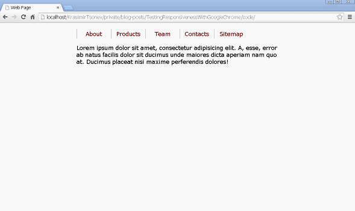
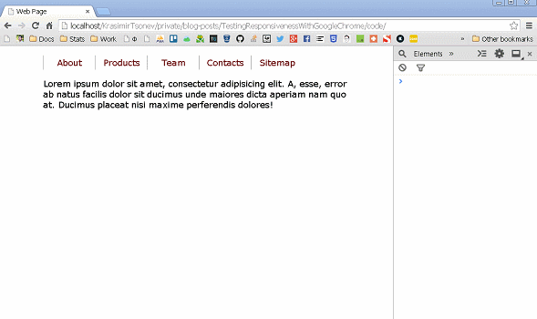
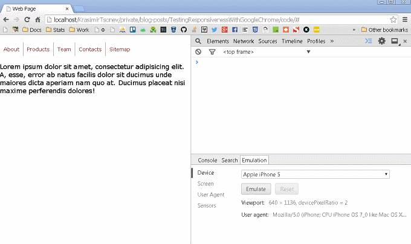

We all know what *responsive* means nowadays. We, as developers, normally develop responsive applications. There are dozen of instruments helping us achieving our goals. Some of us use extensions and even pay for them. However, I'm using one one thing - [Google Chrome](www.google.com/intl/en/chrome/browser/) browser. In this article we will see what are the Chrome's capabilities for testing responsiveness.

## Choosing the subject of testing

We need a simple web site to play with. Let's create one. The following HTML markup shows our page in its initial state. It contains navigation and few lines of text. In the process of reading this article we will add more tags.

	<!doctype html>
	<html>
	    <head>    
	        <title>Web Page</title>
	        <meta http-equiv="Content-Type" content="text/html; charset=utf-8" />
	        <link rel="stylesheet" href="styles.css">
	    </head>
	    <body>
	        

	            <nav>
	                <a href="#">About</a>
	                <a href="#">Products</a>
	                <a href="#">Team</a>
	                <a href="#">Contacts</a>
	                <a href="#">Sitemap</a>
	            </nav>
	            <section>
	                
Lorem ipsum dolor sit amet, consectetur adipisicing elit. A, esse, error ab natus facilis dolor sit ducimus unde maiores dicta aperiam nam quo at. Ducimus placeat nisi maxime perferendis dolores!

	            </section>
	        

	    </body>
	</html>

Here is the content of the <i>styles.css</i> file:

	body {
		margin: 0;
		padding: 0;
		width: 100%;
		height: 100%;
		font-family: Verdana;
		font-size: 18px;
	}
	.content {
		width: 640px;
		margin: 20px auto 0 auto;
	}
	nav:after {
		display: table;
		content: " ";
		clear: left;
	}
	nav a {
		color: #731515;
		text-decoration: none;
		display: block;
		float: left;
		width: 100px;
		text-align: center;
		padding: 4px;
		border-left: solid 1px #999;
	}

Some really basic styling of the <i>body</i> tag and the menu. The result looks like on the picture below.

## Basic responsiveness

As it is now our page is not responsive. If we shrink the browser a bit we will see a horizontal scroller. That's bad because the users will see the same thing if they open our site on lower resolutions. On some devices they may not see a scroller but will get the content cut of. So our first task is to solve that problem. We will use media queries to change the fixed width of the <i>.content</i> div. In order to do this we have to pick break points first. There is something very important while we are doing this. The break points should be based on how our content behave. We should not choose some resolutions just because they are widely used by the device vendors. The idea is to start changing the viewport's width and see when the horizontal scroller become visible. For example:

Instead of resizing the whole browser window I found that it is much easier to show the developer tools panel and resize it. Notice that my own is placed on the right side of the screen. The really cool thing is that Chrome shows us the current viewport's size and we are able to see where exactly will be the break point. In our case it is at 640px, but this is obvious because that's the width of our main container. So let's add the following CSS:

	@media all and (max-width: 640px) {
		.content {
			max-width: 640px;
			width: auto;
		}
	}

This will make our container much flexible. If the user sees our site on a big screen its width will be still 640px, but if it is on a lower resolution the div will get the width of the viewport. However, checkout the following image. We still get a problem at around 550px where our navigation become on two lines.

We need another media queries which make the links smaller and position them below each other on the lower resolutions.

	@media all and (max-width: 550px) {
		nav a {
			width: auto;
			font-size: 14px;
			padding: 10px;
		}
	}
	@media all and (max-width: 370px) {
		nav a {
			float: none;
			width: 100%;
			text-align: center;
			border-left: none;
			padding: 10px 0 10px 0;
		}
	}

And here is the result:

## Emulating devices

Okey, we resized the viewport and saw how our content changes based on the available space. However, we are far away from making our site responsive. That's because we run our code in a desktop browser on a desktop machine. The browsers installed on our laptop are really different from the ones used on the mobile devices. In practice they control the viewport differently. Thankfully we don't have to buy all the mobile phones or tables in the world to perform tests. The emulation which is made in Chrome is enough to give us idea how our design will look. It is not 100% accurate but it is an option.

Let's first briefly introduce the tooling in Google's browser. There is a panel called *Emulation* containing all the available instruments. To see that panel we have to enable it from the console's preferences.

Now let's see our little experiment in iPhone5 device. We need to open the <i>Emulation</i> panel and choose *Apple iPhone 5* in the <i>Device</i> section. A few things happen. First, Chrome autoconfigure the next sections by applying values typical for the iPhone5 phone. It resizes the viewport on the left so it matches the needed resolution. This is really important because we (the developers and designers) work with CSS pixels. Very often I see how my colleagues use the device pixels as a starting point which is kinda wrong. The resolution of the iPhone5 device is 640x1136 but this doesn't mean that we have 640px by width. We still have [320px](http://i-skool.co.uk/mobile-development/web-design-for-mobiles-and-tablets-viewport-sizes/) because the device pixel ration is equal to two. If you want to learn more about how mobile browsers handle the viewport sizes checkout the talk [*A Pixel is Not a Pixel*](http://krasimirtsonev.com/blog/article/A-Pixel-is-Not-a-Pixel-Learn-about-Viewports-with-PPK) by PPK. Here is how our page behaves.

Notice that the content is super huge and it is not readable at all. The user has to scroll or zoom-out to see the whole page. In the image above I hold the <i>Shift</i> key and drag the mouse to simulate "pinch". Doesn't look right. Our media queries are not working at all and that's because we are seeing only part of our viewport but in practice is a lot more. To fix this problem we need to add one more tag in the <i>head</i> of the document.

	<meta name="viewport" content="user-scalable=no, width=device-width, initial-scale=1.0, maximum-scale=1.0" />

With that tag we are basically saying that we want our viewport with same width as the device. We are also setting the initial and maximum scale to 1 and preventing the user from pitching. The result is much much better.

Now, our media queries work and everything is displayed as we wanted.

## Emulating touch events

The developers from Google gave us this nice feature so we can simulate touch events. All we have to do is to enable this functionality in the same panel. It's under <i>Sensors</i> section. In order to see that we are firing touch events we will use the following JavaScript code:

	

Every time when a touch event is captured we will replace the content of the paragraph with the type of the event. Here is the result:

## Emulating different browsers

I know what you are thinking about and *No* you can't make a real simulation of IE, Firefox or Opera. The thing which you can do is to spoof the user agent. However, it is still useful if you have some JavaScript that acts differently based on the current browser. For example, the following code checks if we are using Internet Explorer:

	document.addEventListener("click", function() {
        if (navigator.userAgent.indexOf('MSIE') !== -1 || navigator.appVersion.indexOf('Trident/') > 0) {
			paragraph.innerHTML = 'Yes, it is IE.';
        } else {
            paragraph.innerHTML = 'No, it is not IE.';
        }
    });

Here is how this could be tested in Chrome:

## Summary

I really wanted to show you that you don't need an extension to build responsive web sites. The Google's browser has enough features and it is completely free. A detailed documentation of the <i>Emulation</i> panel could be found [here](https://developer.chrome.com/devtools/docs/mobile-emulation).